# DC1.Azure — Demo Runbook (v1, AAP-driven)

The Solutions-Engineer script for running the **DC1.Azure** infrastructure demo
straight from the **AAP web UI**. The goal: a customer watches Ansible
Automation Platform stand up real VMs in Azure — Windows Server 2025 and/or
RHEL 9 Linux — configure them, and serve a live web page, in about ten minutes
from a single survey click.

> **Multi-OS (Phase 16):** the workflow survey now includes an `os_type`
> parameter (windows / linux / both, default windows). The demo script below
> focuses on the Windows flow (the original story); for Linux, the
> configure chain runs Apache instead of IIS and the VM is reachable via SSH
> instead of RDP. The workflow and triggers are the same regardless of OS.

> **This is the v1 (AAP-driven) flow.** The same workflow is later surfaced
> through the AAP Self-Service Portal (Phase 9), ServiceNow (Phase 8), and Azure
> DevOps (Phase 10). Those triggers reuse the *exact* workflow documented here —
> only the front door changes. See [`ROADMAP.md`](../ROADMAP.md).

---

## At a glance

| | |
|---|---|
| **Front door** | AAP web UI → Templates → *DC1.Azure - Provision and Configure* |
| **Inputs** | `os_type` survey (windows / linux / both) + `vm_size_tier` (small / medium / large) |
| **Run time** | ~10 min provision + configure (Provision VM dominates at ~7 min) |
| **Payoff** | Browse `http://<vm-fqdn>` → live IIS page (Windows) or Apache page (Linux); RDP or SSH access |
| **Cleanup** | Auto-destroys nightly at **18:00 America/Phoenix (01:00 UTC)**; or run *DC1.Azure - Teardown* manually |
| **Cost guardrail** | The nightly teardown means a forgotten VM costs at most one evening |

**Observed timings (live workflow job 60, `medium-2cpu-8gb`):**

| Node | Typical | What's happening |
|------|---------|------------------|
| Provision VM | ~7 min | `terraform apply` builds VNet/NSG/public IP/VM, then registers the host into the `dc1-azure` inventory |
| Powershell Improvement | <1 min | Installs PowerShell 7 |
| Website Setup | ~2 min | Installs IIS + deploys the Azure demo landing page |
| Provision Access | <1 min | Creates the demo Windows account |
| Patching | ~1 min | Applies Windows Updates |
| **Total** | **~10 min** | end-to-end, green |

---

## Personas

- **You (the SE / platform engineer)** — narrate the platform's value while it
  works. You drive the AAP UI.
- **The customer's app developer / requester** — the person who, in the
  end-state demo, would self-serve a VM. In v1 you *speak as if* you are them
  ("I need a Windows box, medium size, now"), then show the platform deliver it.
- **The customer's platform/ops team** — the audience who cares that this is
  governed, repeatable, and self-cleaning (one workflow, one survey, audited
  jobs, nightly teardown).

---

## 1. Pre-flight checklist (do this before the customer is watching)

Run through this 15–20 minutes ahead. Most failures are environmental, not
demo-logic.

- [ ] **RHDP Azure open env is alive** — not expired. Confirm the resource
      group still exists and the Service Principal still authenticates.
- [ ] **AAP is reachable** — log into the AAP UI in a browser tab and leave it
      open. (URL + creds live in your gitignored `docs/dev-environment.sh`.)
- [ ] **The DC1.Azure project is synced to the latest `main`** — Projects →
      *DC1.Azure* → sync. The project no longer auto-syncs on launch (AB#74, for
      speed), so a manual sync after any code change is on you. API shortcut:
      `POST /api/controller/v2/projects/21/update/`.
- [ ] **`dc1-azure` inventory is empty (0 hosts)** — a leftover host from a prior
      run is cosmetic but looks sloppy on screen. If the nightly teardown ran,
      it's already clean.
- [ ] **Azure quota headroom** — `medium-2cpu-8gb` (4 vCPU) is the safe default.
      Only pick `large-4cpu-16gb` (8 vCPU) if you've confirmed the RHDP
      subscription's regional vCPU quota allows it.
- [ ] **Nightly teardown schedule is enabled** — Schedules → *DC1.Azure -
      Nightly Teardown*, next run 18:00 America/Phoenix. (Leave it on — it's part
      of the story.)
- [ ] **Decide your tier** up front so you're not hesitating on the survey.

The AAP **Automation Templates** list filtered to `DC1` — every DC1.Azure job
template plus the *DC1.Azure - Provision and Configure* workflow:

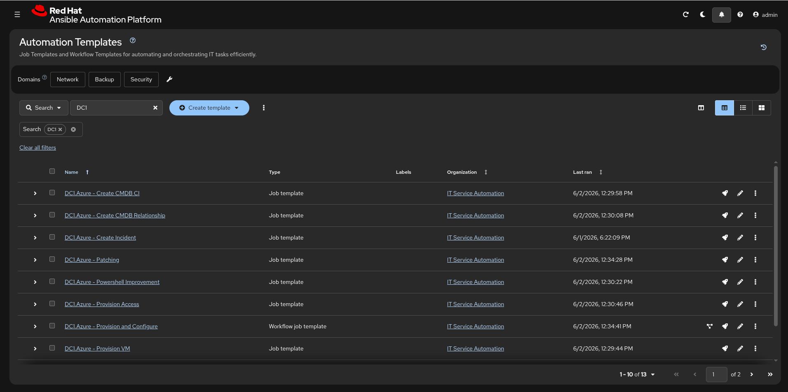

---

## 2. Set the scene (≈60 seconds of talking before you click)

> "Say I'm an application developer and I need a Windows server in Azure —
> today, not next week. Traditionally that's a ticket, a wait, a hand-off
> between teams. With Ansible Automation Platform, the platform team has turned
> that whole process into **one self-service action**. I pick a size, I click
> launch, and the platform does the rest — provision the cloud infrastructure,
> harden and configure the OS, stand up the app, and even clean itself up
> overnight so we're not paying for idle VMs."

Key points to land:
- **One workflow, many front doors.** Today I'm in the AAP UI; the same workflow
  is exposed via Self-Service, ServiceNow, and Azure DevOps — identical result.
- **Infrastructure *and* configuration.** Terraform builds the Azure resources;
  Ansible configures the OS. One platform orchestrates both.
- **Governed and repeatable.** Every run is an audited job. Same inputs → same
  result, every time.

---

## 3. Run it — click-by-click (AAP web UI)

### 3.1 Log in
Open the AAP UI. You should already be authenticated from pre-flight.

### 3.2 Open the workflow template
Left nav → **Automation Execution → Templates**. Find
**`DC1.Azure - Provision and Configure`** (type: *Workflow Job Template*).

The **Workflow Visualizer** for *DC1.Azure - Provision and Configure* (11 nodes).
The graph is wide, so it's shown in panned sections, left → right:

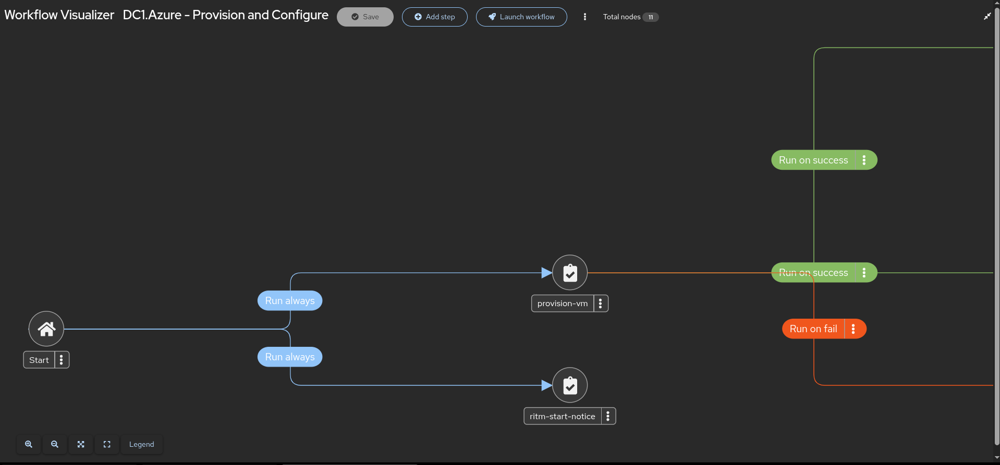

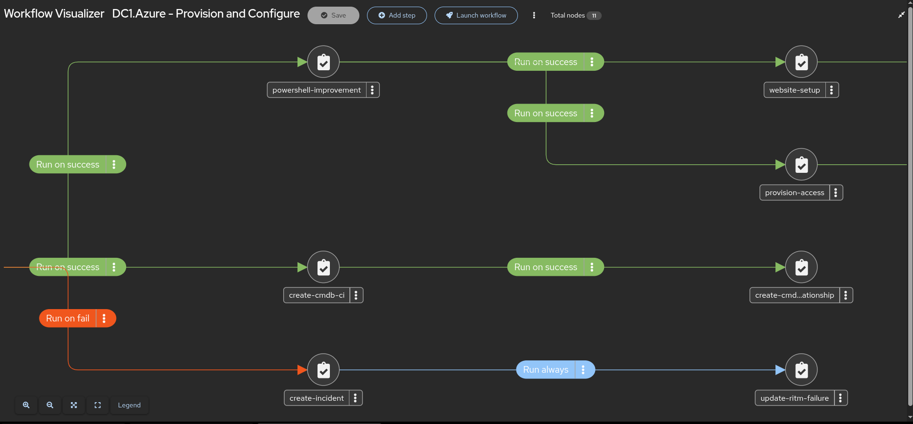

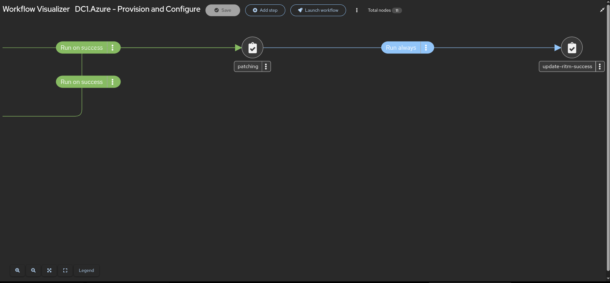

### 3.3 Launch and answer the survey
Click **Launch**. A single-question survey appears:

- **VM size tier** — choose your pre-decided tier. Default is
  `medium-2cpu-8gb`. Narrate: *"This is the only decision the requester
  makes — t-shirt sizing, no Azure SKU knowledge required."*

Submit the survey to start the run.

The **`vm_size_tier` survey** — the three t-shirt tiers (small / medium / large,
all B-series burstable), with `medium-2cpu-8gb` as the default:

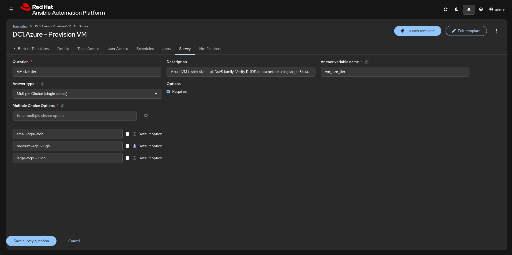

### 3.4 Watch the workflow graph
The workflow visualizer shows the run unfold left-to-right. The `os_type` survey
controls which configure branch does real work — Windows (`windemo`), Linux
(`linuxweb`), or both in parallel. The unused OS chain targets an empty group and
is silently absorbed. On an AAP-UI launch the ServiceNow callback nodes also run
but no-op without a ticket (see §7).

**Windows path** (`os_type=windows`):

| # | Node | What to say |
|---|------|-------------|
| 1 | **Provision VM** | "Terraform is building the Azure footprint — virtual network, security group, public IP with a DNS name, and the Windows Server 2025 VM at the size I picked. When it finishes, the platform registers the new host into its own inventory so the next steps can reach it." *(This is the long one — ~1 min. Good moment for Q&A or to talk architecture.)* |
| 2 | **Powershell Improvement** | "Now we're configuring the OS — installing PowerShell 7, a modern shell for whatever the app team runs next." |
| 3 | **Website Setup** | "Installing IIS and deploying a demo web app — so we end on something the customer can actually see in a browser." |
| 4 | **Provision Access** | "Creating the demo user account — access provisioning is part of the same automated flow, not a separate ticket." |
| 5 | **Patching** | "Applying Windows Updates. The VM is born already patched — no drift, no manual hardening step." |

**Linux path** (`os_type=linux`):

| # | Node | What to say |
|---|------|-------------|
| 1 | **Provision VM** | Same as above, but "…and the RHEL 9 Linux VM…" |
| 2 | **Configure Linux** | "One step does everything: time sync (Chrony), Cockpit removal for security hardening, Apache web server with firewall rules, security banners on SSH and console login, Red Hat Insights registration, dnf security patches, and a branded landing page — same pattern as the Windows chain, different OS." *(~10 min; the dnf security updates are the slow part.)* |

The **Jobs list** after a clean run — the *DC1.Azure - Provision and Configure*
workflow job and every child playbook (Provision VM, Powershell Improvement,
Website Setup, Provision Access, Patching, the CMDB + RITM callbacks) all
**Success**:

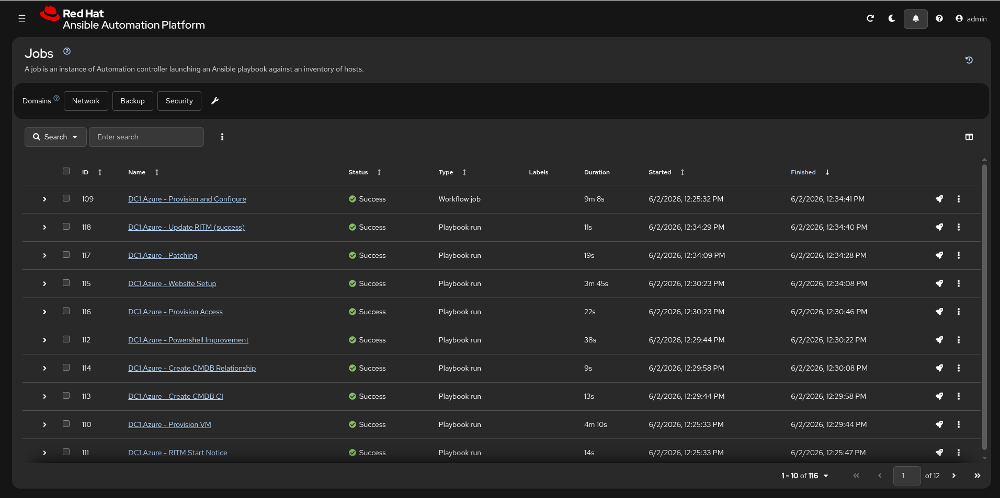

---

## 4. The payoff — show the running machine

### 4.1 Get the VM's address
The DNS name follows the pattern:

```
dc1az-<tier>-<random>.<region>.cloudapp.azure.com
```

e.g. `dc1az-medium-2cpu-8gb-z8crz.eastus.cloudapp.azure.com`. Get the exact
value from either:
- the **Provision VM** job output (the `fqdn` / `ansible_inventory` Terraform
  output), or
- the host's name in the **`dc1-azure` inventory** (Inventories → *dc1-azure* →
  Hosts), or
- the Azure portal (public IP resource).

### 4.2 Browse to it
Open `http://<vm-fqdn>` in a browser. The IIS landing page shows:

- A welcome header and the AAP logo
- **"This website is running on Microsoft Windows Server 2025 Datacenter on Azure"**
- A **Provisioning Details** panel: Request Number, Server DNS Name, Azure
  Region, VM Size, Platform
- A red note: *"The DC1.Azure Windows Demo will auto destruct at 01:00 hrs UTC time."*

Narrate: *"This page is served by the VM the platform just built and
configured. Everything you see — the OS, IIS, this app, the patch level — was
done by that one workflow, from one survey click."*

> **Note:** the **Request Number** field shows `N/A` in v1 — it's wired to the
> ServiceNow RITM number, which arrives with the Phase 8 ServiceNow integration.
> That's expected; don't apologize for it.

The live **IIS landing page** the workflow stands up, served from the Windows VM
itself (the address bar shows the VM's FQDN):

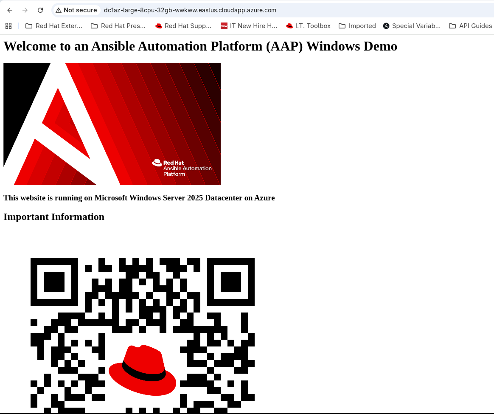

…and the **Provisioning Details** lower on the page. Note the **Request Number**
is populated here (`RITM0011939`) because this run was triggered from ServiceNow
(Phase 8) — a v1 AAP-UI launch shows `N/A` (see the note above):


### 4.3 (Optional) RDP in
If the room wants to see a real desktop: RDP to the same FQDN as
**`demoadmin`** (the admin password is the one you set via
`WINDOWS_ADMIN_PASSWORD` at install). Show PowerShell 7 and the demo account to
prove the configuration steps landed.

---

## 5. Teardown — the self-cleaning story

This is a selling point, not an afterthought — say it out loud.

- **Automatic:** the **`DC1.Azure - Nightly Teardown`** schedule runs the
  *DC1.Azure - Teardown* job template every night at **18:00 America/Phoenix
  (01:00 UTC)** — exactly the time the landing page advertises. It runs
  `terraform destroy` and deregisters the host, returning the `dc1-azure`
  inventory to zero. *"A VM someone forgets about costs at most one evening."*
- **Manual:** to tear down on demand (e.g. right after the demo), launch
  **Templates → `DC1.Azure - Teardown`**. No survey, no inputs — it reads the
  Terraform state and destroys what's there. ~7 minutes.

> The Teardown JT deliberately runs against a small **`dc1-azure-control`**
> inventory (not `dc1-azure`) so it can deregister the VM's host without AAP
> locking it as "in use" (AB#73). You don't need to mention this on stage — it's
> just why teardown reliably goes green.

The **`dc1-azure` inventory empty** after the Teardown job — no leftover hosts,
proving the self-cleaning story (the *DC1.Azure - Teardown* job itself reports
*Success*):

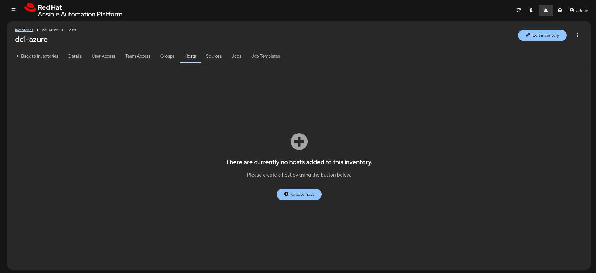

---

## 6. Reset between back-to-back demos

If you're running the demo more than once in a day:

1. Run **`DC1.Azure - Teardown`** (or wait for the nightly).
2. Confirm **`dc1-azure`** is back to **0 hosts**.
3. Re-launch the workflow for the next audience.

There's no other state to clear — Terraform state lives in Azure Storage and is
reused; the next provision starts clean.

---

## 7. The ServiceNow-driven variant (Demo v2 — event-driven)

Same workflow, different front door: a business user requests the VM from the
**ServiceNow self-service catalog** and never touches AAP. This is the higher-value
story for an ITSM audience — *"your existing request process, now fulfilled by
automation, with the ticket and CMDB updated automatically."* Full design:
[`servicenow-integration.md`](servicenow-integration.md).

**How it flows**

```
ServiceNow catalog request  →  Business Rule → Outbound REST Message
   →  AAP EDA event stream  →  rulebook (matches short_description)
   →  DC1.Azure - Provision and Configure  (the same v1 workflow)
   →  Provision VM success → Create CMDB CI → Relationship (parallel, early)
      Patching always → Update RITM (Fulfilled, with FQDN/IP)
      failure: Create Incident → Update RITM (failed, cites the incident #)
```

The requester sees the RITM auto-fill with the VM's FQDN + public IP + admin
**username** (never the password) and the new CMDB CI appear — then closes the
ticket. No AAP login required.

**One-time setup (before the first ServiceNow demo)**

1. **Rebuild the EE.** PR2 added `servicenow.itsm` to the EE — rebuild + push
   `DC1.Azure - EE` and re-sync it in AAP (see `execution-environment.yml` build
   provenance). Without this the callback JTs fail to find the collection.
2. **Apply the CaC** — `load.yml` creates the `DC1.Azure - ServiceNow` credential,
   the five callback JTs, and the workflow nodes (and the Phase-8 EDA inbound
   objects). Confirm `validate.yml` is green and the rulebook activation is
   *running*.
3. **In ServiceNow** (one-time):
   - Catalog item **"Ames - Request Infrastructure (Azure)"** whose **Short
     description** is exactly `DC1.Azure Infrastructure Provisioning` (the
     rulebook matches this string), with `os_type` and `vm_size_tier` choice
     variables mirroring the survey.
   - A **Business Rule** on `sc_req_item` that fires an **Outbound REST Message**
     `POST`ing to the EDA **event-stream URL** with
     `Authorization: Bearer <EDA_EVENT_STREAM_TOKEN>` and a JSON body of
     `number`, `sys_id`, `short_description`, `vm_size_tier`.

**Smoke-test the trigger without ServiceNow** (proves the inbound half):

```bash
source docs/dev-environment.sh && \
curl -sk -X POST '<event-stream-url-from-AAP>' \
  -H "Authorization: Bearer $EDA_EVENT_STREAM_TOKEN" \
  -H 'Content-Type: application/json' \
  -d '{"number":"RITM0099999","sys_id":"test","short_description":"DC1.Azure Infrastructure Provisioning","vm_size_tier":"medium-2cpu-8gb"}'
```

The workflow should launch within a few seconds (Automation Decisions → Rulebook
Activations → *DC1.Azure - Catch ServiceNow Events* shows the event; Templates
shows the new job).

**Running it live**

1. Open the ServiceNow catalog item, pick a size, submit.
2. Show the RITM moving as the workflow runs; narrate the same node story as §3.4.
3. Payoff: the RITM work note fills with the connection details and the **CMDB CI**
   appears with its relationship — *the ticket closed itself out with real data.*
4. **Failure demo (optional but powerful):** force a Provision VM failure (e.g.
   request `large` against exhausted quota) and show the **Incident** opening
   automatically with the job ID + error, and the RITM citing the incident number.

The **catalog item** the requester orders from — *DC1.Azure Infrastructure
Provisioning*, with `os_type` and `vm_size_tier` choices:

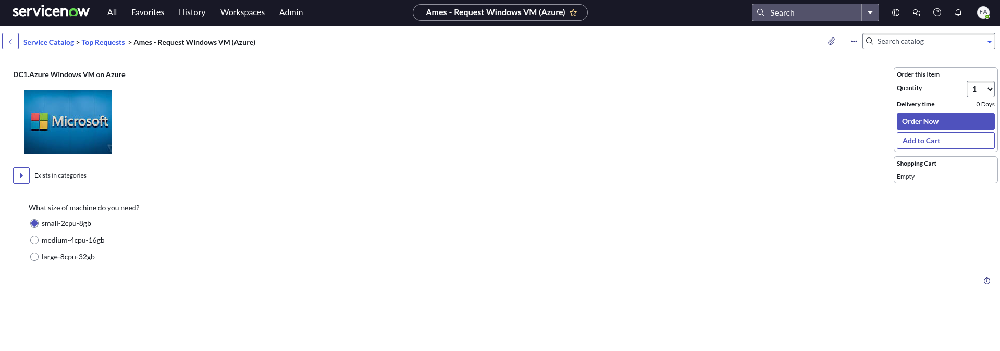

The auto-updated **RITM** — its *Configuration item* now linked to the new CMDB
CI (AB#93) and State *Closed Complete*, with the connection details posted as a
work note:

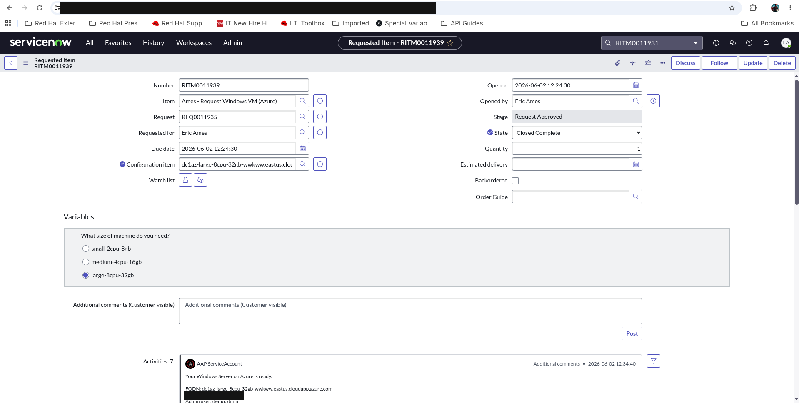

The new **CMDB CI** (class *Windows Server*) with its *Uses → Ansible
Demonstrations* business-application relationship:

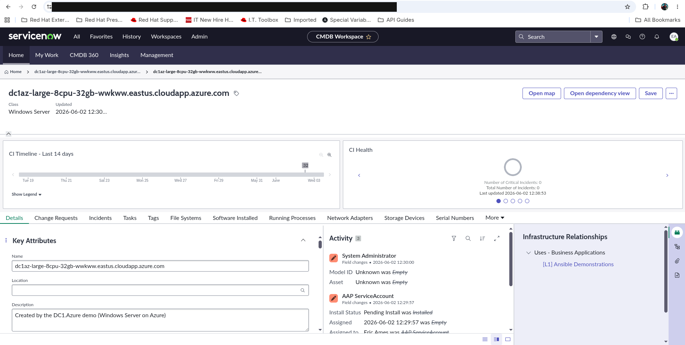

> **Non-ServiceNow triggers stay green:** the callback JTs no-op when there's no
> `ticket_number`, so launching the *same* workflow from the AAP UI (§3),
> Self-Service Portal (Phase 9), or ADO (Phase 10) skips the ServiceNow nodes.

---

## 8. The Self-Service Portal variant (Phase 9)

Same workflow, a third front door: a **developer self-serves the VM from the
AAP Self-Service Portal** (Red Hat Developer Hub) with **least-privilege** access
and no AAP admin login. The story for a platform-engineering audience —
*"curated, governed self-service: a junior dev gets exactly one button, and the
platform team controls everything behind it."*

**How it flows**

```
jr-dev logs into the Self-Service Portal  →  sees ONLY the templates the
   DC1.Azure - Developers team is granted (least-privilege)
   →  Starts "DC1.Azure - Request Infrastructure" (picks vm_size_tier)
   →  launcher JT fires DC1.Azure - Provision and Configure  (the same v1 workflow)
   →  VM provisioned + configured (identical result to §3 / §7)
```

> **Why a launcher JT?** The portal auto-syncs **job templates only — not workflow
> job templates** (confirmed live + Red Hat 2.6 docs). So a thin launcher *job*
> template (`DC1.Azure - Request Infrastructure`, running `playbooks/launch_workflow.yml`
> → `ansible.controller.workflow_launch`) is the portal-surfaced entry point that
> fires the existing workflow — no parallel implementation. `jr-dev` runs the
> launcher; the workflow runs under the `DC1.Azure - Controller` credential, so the
> dev needs no direct workflow or credential access.

**One-time setup**

1. **Deploy the portal** — RHDH `redhat-rhaap-portal` Helm chart on OpenShift, via
   the [`aap.selfservice`](https://github.com/ericcames/aap.selfservice) repo
   (`bootstrap_portal.yml` + `sync_portal_orgs.yml`). dc1.azure references it; it is
   not vendored here. *Skip that repo's `bootstrap_aap.yml` on an already-configured
   AAP — it duplicates platform creds (aap.selfservice issue #45).*
2. **Apply the CaC** — `load.yml` creates the `DC1.Azure - Developers` team, the
   `dev-lead` (Organization Admin) + `jr-dev` (least-privilege) users, the launcher
   JT, and the team's **JobTemplate Execute** grants on the launcher + the Gather-
   and-Display-Facts JT. Passwords come from `DC1_AZURE_DEV_ADMIN_PASSWORD` /
   `DC1_AZURE_JR_DEV_PASSWORD`.
3. **Re-sync the portal after any AAP RBAC change** — run `aap.selfservice`'s
   `sync_portal_orgs.yml` (it **restarts** the portal → rebuilds per-user access).
   The in-UI **"Sync now"** button only does an incremental data pull and does
   **not** re-evaluate per-user access (aap.selfservice issue #46).

**Running it live**

1. Open the portal URL (incognito), log in as **`jr-dev`**. Note the top-right shows
   the dev, not an admin — and the **Templates** view lists *only* the two cards the
   team is entitled to. Everything else in AAP is invisible to them.
2. Start **`DC1.Azure - Request Infrastructure`**, pick a `vm_size_tier`, submit. The
   portal task finishes quickly ("executed successfully") — the launcher *fires* the
   workflow and returns.
3. Switch to AAP (Automation Execution → Jobs) and show **`DC1.Azure - Provision and
   Configure`** running — narrate the same node story as §3.4. Same payoff as §4.

The portal as **`jr-dev`** — exactly the two least-privilege cards (the launcher +
the facts JT), nothing else:

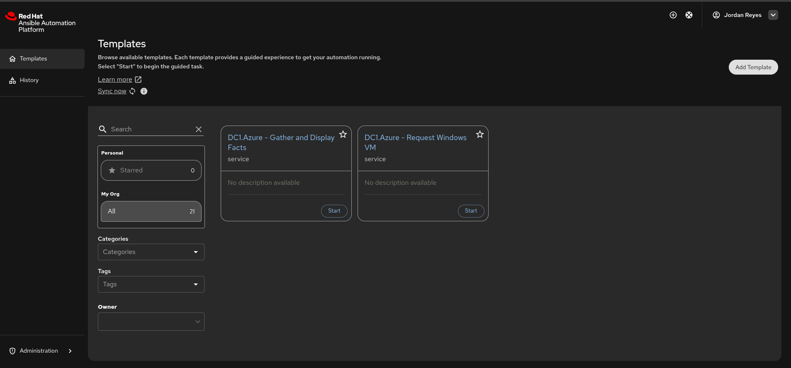

Starting **Request Infrastructure** — the auto-generated request form mirrors the JT's
`vm_size_tier` survey:

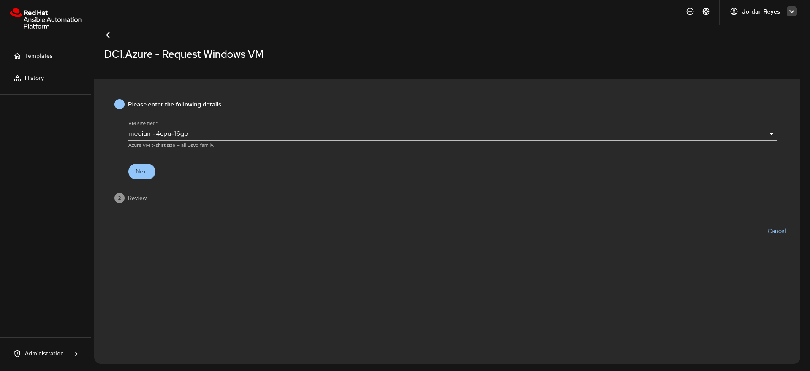

The portal reports the launch **executed successfully** — the launcher's log shows
*"Launched 'DC1.Azure - Provision and Configure' … workflow job id 152"*; the
workflow then provisions the VM (watch it in AAP Jobs, §3.4):

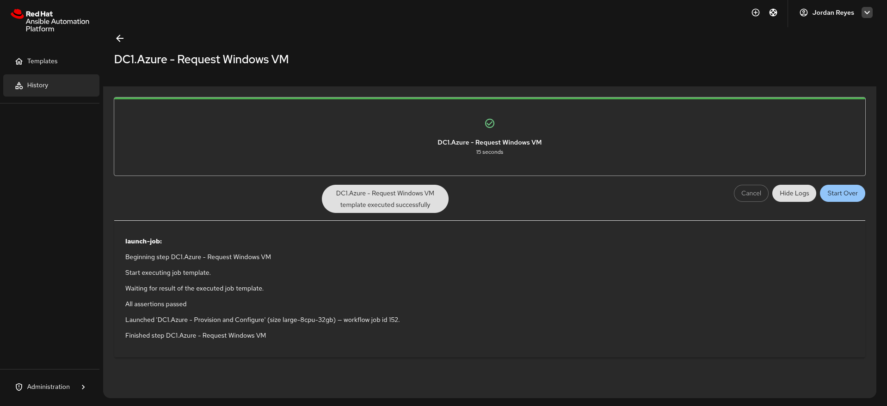

`jr-dev` is also granted the **Gather and Display Facts** JT, so the same
self-service motion lets them inventory a host — the curated facts print to the job
log and the full set is cached in the AAP database (Infrastructure → Hosts → Facts):

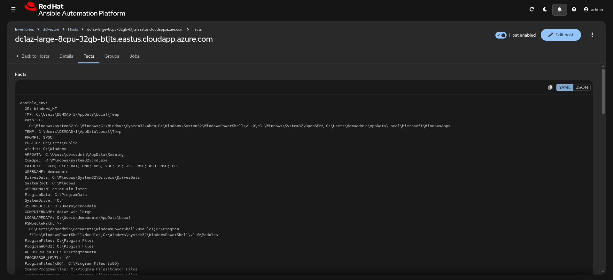

> **Least-privilege, proven:** `jr-dev` can Start *only* the launcher + facts JTs —
> not the workflow directly, not Provision VM, not Teardown. AAP enforces this at
> launch; the portal just surfaces what the team is granted.

---

## 9. The Azure DevOps variant (Phase 10)

The **fourth and final trigger**. Same Windows VM, same `DC1.Azure - Provision
and Configure` workflow — this time fired from an **Azure DevOps pipeline**. For
a customer whose change process already lives in ADO, "kick off provisioning
from a pipeline run" is the natural entry point; AAP stays the orchestrator.

```
SE / requester clicks "Run pipeline" in ADO  →  picks a VM size (parameter)
   →  azure-pipelines-launch.yml POSTs to the AAP launch endpoint
   →  AAP runs DC1.Azure - Provision and Configure   (the same v1 workflow)
   →  the pipeline prints the workflow-job deep link and exits green
```

> **Phase 5 vs Phase 10 — two different pipelines.** `azure-pipelines.yml`
> (Phase 5) is CI: it lints/validates every PR and mirrors `main` to GitHub. It
> never provisions anything. `azure-pipelines-launch.yml` (Phase 10) is the
> *trigger*: manual-run only (`trigger:`/`pr: none`), it launches the AAP
> workflow on demand. Committing to the repo never fires a provision.

### 9.1 One-time setup (operator)

1. **Variable Group** — in *Pipelines → Library*, create `dc1-azure-aap` with:
   - `AAP_HOSTNAME` — the gateway base URL, e.g. `https://<gateway>.rhdp.net`
   - `AAP_TOKEN` — a **UI-minted** AAP API token, marked **secret** (this AAP is
     SSO and can't basic-auth-mint; a manually-minted token works for API calls).
2. **Register the pipeline** — *Pipelines → New pipeline → Azure Repos Git →
   dc1.azure → Existing YAML → `/azure-pipelines-launch.yml`*. Name it something
   like *DC1.Azure — Launch Windows VM*.

See [`ado-conventions.md`](ado-conventions.md) §7 for the Library entry.

### 9.2 Run it (the demo motion)

1. *Pipelines →* **DC1.Azure — Launch Windows VM** *→ Run pipeline*.
2. Pick **VM size tier** from the dropdown (`small` / `medium` / `large`) and
   click **Run**.
3. The single `Launch AAP provisioning workflow` step resolves the workflow by
   name, POSTs the launch, and prints:

   ```
   ===================================================================
    Launched 'DC1.Azure - Provision and Configure'
      size:         medium-2cpu-8gb
      workflow job: 161
      watch:        https://<gateway>/execution/jobs/workflow/161/output
   ===================================================================
   ```

   The same link is attached to the **run summary** page (Extensions tab), so
   one click jumps from the ADO run straight to the live AAP workflow graph.

> **Fire-and-forget, by design.** The pipeline exits green the moment the
> workflow is launched — it does **not** wait for the VM to finish. You watch
> the actual provisioning in AAP via the printed link, exactly as with the other
> three triggers (the Self-Service launcher JT uses `wait: false` too). This
> keeps the ADO run short on stage and avoids tying the pipeline up for the full
> provision-and-patch cycle.

> **Validated live 2026-06-03:** an ADO run (`large-4cpu-16gb`) launched workflow
> job 163 — the same `DC1.Azure - Provision and Configure` workflow, all nodes
> green, the guarded ServiceNow nodes no-op'd on the ticket-less launch.

📸 _Screenshot still to capture: the ADO "Run pipeline" dialog showing the
`vm_size_tier` dropdown, and the completed run with the workflow-job link on the
summary page (see Appendix B)._

> **Same workflow, four front doors.** AAP UI (§3), ServiceNow (§7),
> Self-Service Portal (§8), and ADO (§9) all launch the *identical*
> `DC1.Azure - Provision and Configure` workflow — no parallel definitions. The
> trigger is a thin adapter; the automation is one workflow.

---

## 10. The Automation Calculator — closing the ROI story

After you've shown the automation *run* (any of §3/§7/§8/§9), close with the
business value. **Automation Analytics → Automation Calculator** turns the job
runs into a dollar figure the customer's leadership cares about.

**Pre-req:** analytics must be enabled (it is, via
`aap_config/files/controller_settings.yml` + the `REDHAT_SUBSCRIPTIONS_*` creds —
see INSTALL §5) **and** an upload must have already shipped. If the calculator is
empty, force an upload from **Settings → Subscription** and re-run a JT or two,
then give it a few minutes.

**Click-by-click:**
1. Left nav → **Automation Analytics → Automation Calculator**.
2. Toggle the **Executive / Job template / Savings** views top-right.
3. Point out **Total savings** — the headline number across all templates.
4. Adjust the two sliders live: **Manual cost of automation** (e.g. a mid-level
   engineer's hourly cost) and **Automated process cost**. The savings recompute
   in front of the customer — this is the "what's it worth to *you*" moment.

**Talk-track:** "Every workflow you just watched is reporting back here. This is
the same data your leadership would see — automation hours saved, translated to
the rates *you* set. The platform makes the ROI case for you."

---

## Appendix A — Failure modes & recovery

| Symptom | Likely cause | Fix |
|---------|--------------|-----|
| **Provision VM fails fast at `terraform apply`**, error mentions quota/`SkuNotAvailable` | RHDP subscription is out of regional vCPU quota for the chosen tier | Re-launch with a smaller tier (`small-2cpu-4gb`); for the demo, default to `medium`. Don't pick `large` without confirming quota in pre-flight. |
| **Provision VM fails at auth / `terraform init`** | RHDP env expired, or Service Principal / storage-account backend creds stale | Re-activate the RHDP env; refresh values in `docs/dev-environment.sh`; re-apply `aap_config/load.yml` so the AAP credentials match. |
| **Workflow runs *old* playbook behavior after a code change** | Project didn't sync — update-on-launch is off (AB#74) | Manually sync the *DC1.Azure* project (Projects → sync, or `POST /api/controller/v2/projects/21/update/`) and re-launch. |
| **A configure node (Powershell/Website/Access/Patching) fails to connect** | WinRM not up yet, or the host didn't register into `dc1-azure` | Confirm the host appears in the `dc1-azure` inventory; give the VM a minute and **Retry** the failed node (the workflow supports node-level retry). If WinRM never comes up, tear down and re-provision. |
| **`load.yml` / any API step returns 401** | AAP token expired | Mint a fresh gateway token (the `/install-dc1-azure` skill or the token pattern in the project notes) and re-run. The stored token in `dev-environment.sh` is not long-lived. |
| **Teardown reports failed but the VM is gone** | Pre-fix behavior (AB#71/72/73) | Should not recur — all three are fixed and live-validated (job 68 green, inventory cleared). If it does, delete the orphan host from `dc1-azure` via the API and file a work item. |
| **Landing page won't load** | NSG/port, IIS not finished, or DNS not yet propagated | Confirm the Website Setup node was green; try the public IP directly; give DNS a moment. Port 80 is opened by the NSG in Terraform. |

---

## Appendix B — Screenshots to capture

Capture these once on a clean run and commit them to `docs/images/` (committed,
not gitignored — so they render on GitHub for everyone). Then replace the
inline 📸 placeholders above with real `` embeds.

- [x] `demo-00-templates.png` — AAP Templates list showing the DC1.Azure objects — captured 2026-06-02 (no redaction needed)
- [x] `demo-01-workflow-template-{1,2,3}.png` — the *Provision and Configure* workflow visualizer (11-node graph, captured in three panned tiles) — 2026-06-02 (no redaction needed)
- [x] `demo-02-survey.png` — the `vm_size_tier` survey dialog — captured 2026-06-02 (no redaction needed)
- [x] `demo-03-workflow-success.png` — Jobs list, the workflow job + all child jobs Success — captured 2026-06-02 (no redaction needed)
- [x] `demo-04-landing-page-{1,2}.png` — the live IIS landing page in a browser (top + Provisioning Details) — captured 2026-06-02 (no redaction needed)
- [x] `demo-05-teardown-success.png` — successful teardown + empty inventory — captured 2026-06-02 (teardown job 119 Success; no redaction needed)
- [ ] *(optional)* the ADO Boards Phase 6 epic/board, for the "how this was built" aside
- [x] `demo-06-snow-catalog.png` — the ServiceNow "Request Infrastructure (Azure)" catalog item *(Demo v2, §7)* — captured 2026-06-02 (no redaction needed)
- [x] `demo-07-snow-ritm.png` — the RITM auto-filled with FQDN/IP + Fulfilled state *(Demo v2)* — captured 2026-06-02 (RITM0011939; URL bar + public IP redacted)
- [x] `demo-08-snow-cmdb-ci.png` — the new CMDB CI with its business-app relationship *(Demo v2)* — captured 2026-06-02 (URL bar redacted)
- [ ] `demo-13-ado-launch.png` — the ADO *Run pipeline* dialog with the `vm_size_tier` dropdown, and/or the completed run with the workflow-job link on the summary page *(Phase 10, §9)* — redact the org/gateway URL bar if visible

---

## Appendix C — Quick reference

| Thing | Value |
|-------|-------|
| Workflow | `DC1.Azure - Provision and Configure` |
| Nodes (Windows path) | Provision VM → Powershell Improvement → Website Setup / Provision Access → Patching → Update RITM (success) |
| Nodes (Linux path) | Provision VM → Configure Linux → Update RITM (success) |
| ServiceNow nodes (Demo v2) | CMDB (parallel, early): Provision VM→Create CMDB CI→Create CMDB Relationship; success: Patching `always`→Update RITM (success); failure: Provision VM→Create Incident→Update RITM (failure) — all no-op without `ticket_number` |
| ServiceNow match string | catalog item Short description = `DC1.Azure Infrastructure Provisioning` |
| Survey variables | `os_type` ∈ {`windows`, `linux`, `both`} (default `windows`); `vm_size_tier` ∈ {`small-2cpu-4gb`, `medium-2cpu-8gb`, `large-4cpu-16gb`} (default `medium`) |
| Provision JT | `DC1.Azure - Provision VM` |
| Teardown JT | `DC1.Azure - Teardown` (runs against `dc1-azure-control`) |
| Story inventory | `dc1-azure` (VM host registered at runtime) |
| Project | `DC1.Azure` (ADO `main`; manual sync, no update-on-launch) |
| VM FQDN pattern | `dc1az-<tier>-<suffix>.<region>.cloudapp.azure.com` |
| Default region | `eastus` |
| Admin user | `demoadmin` |
| Nightly teardown | 18:00 America/Phoenix = 01:00 UTC, daily |
| Sizing tiers | small=`Standard_B2s`, medium=`Standard_B2ms`, large=`Standard_B4ms` (B-series burstable) |

See also: [`INSTALL.md`](INSTALL.md) (how to install the CaC),
[`ROADMAP.md`](../ROADMAP.md) (phases + decisions), [`README.md`](../README.md).

> **Optional deeper talking track — supply-chain / EE security.** For a
> security-minded audience, [`ee-security-remediation.md`](ee-security-remediation.md)
> tells how we inspected the EE's Quay security scan, remediated the inherited
> base-image CVEs at build time, and *deliberately deferred* one risky fix — a
> credible "we own our supply chain" story to layer on top of the provisioning demo.
