# Demo Talk Track: Automated Incident Response

*For the DC1.Azure EDA Incident Response demo (Phase 19 / AB#154).
Use this to frame the demo for CIOs, IT directors, ops managers, and anyone
who needs to understand **why** — not just what.*

---

## The Story in 30 Seconds

A web server went down. Nobody called. Nobody paged. Nobody opened a ticket.
Nobody logged in to check. Nobody restarted anything. Nobody wrote up what
happened.

And yet — five minutes later, the service was back up, the incident ticket
told the complete story from detection to resolution, and the monitoring
system independently confirmed the fix worked.

**Zero human intervention. Full audit trail. Complete closed loop.**

---

## A Real Incident: INC0011372

This is not a mock-up. This is a real incident from a live validation run
on June 9, 2026. Dynatrace problem **P-260618**, ServiceNow incident
**INC0011372**, affecting host
`dc1az-lnx-small-2cpu-4gb-6twoz.eastus.cloudapp.azure.com`.

The Apache web server process was stopped at **12:12 PM**. Nobody intervened.
Here is what happened next:

### Timeline

| Time | Elapsed | What happened |
|------|---------|---------------|
| 12:12:51 PM | 0:00 | httpd stopped on the Linux web server |
| 12:15:03 PM | 2:12 | Dynatrace Davis AI detected the failure, pushed event to EDA |
| 12:15:18 PM | 2:27 | Incident INC0011372 created in ServiceNow |
| 12:15:23 PM | 2:32 | Davis AI narrative posted to incident |
| 12:15:40 PM | 2:49 | Automated remediation started |
| 12:15:47 PM | 2:56 | httpd restarted, website verified (HTTP 200) |
| 12:15:55 PM | 3:04 | Local forensics posted (who stopped it, system state, logs) |
| 12:16:11 PM | 3:20 | Davis root cause analysis posted to incident |
| 12:16:13 PM | 3:22 | Executive summary posted, incident resolved |
| 12:17:39 PM | 4:48 | Dynatrace confirmed recovery, confirmation posted |

**From failure to resolved incident with full audit trail: 3 minutes 22 seconds.**
**From failure to independent monitoring confirmation: 4 minutes 48 seconds.**

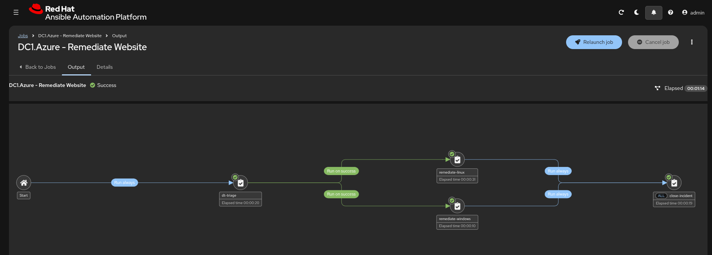

---

## What the Incident Ticket Looks Like

The ServiceNow incident tells the complete story in eight work notes. An
auditor, a manager, or a post-incident reviewer can read it top to bottom
and know exactly what happened — without asking anyone.

### Work Note 1 — Incident Created (12:15:21 PM)

> Incident INC0011372 created for Dynatrace problem P-260618 (Process
> unavailable) on dc1az-lnx-small-2cpu-4gb-6twoz.eastus.cloudapp.azure.com.
> Automated remediation in progress — service restoration first, then root
> cause data collection.

The system already made a decision: it checked ServiceNow for open change
tickets on this server. There were none — so this is an unplanned outage, not
scheduled maintenance. Incident created automatically.

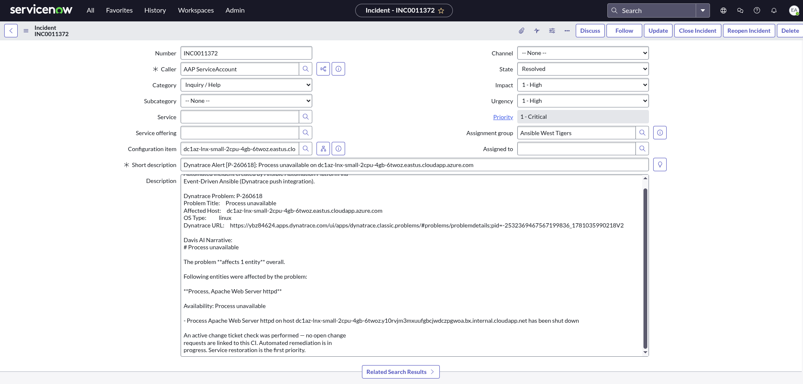

### Work Note 2 — Davis AI Analysis (12:15:23 PM)

> **Process unavailable**
>
> The problem affects 1 entity overall.
>
> Following entities were affected by the problem:
>
> **Process, Apache Web Server httpd**
>
> Availability: Process unavailable
>
> - Process Apache Web Server httpd on host dc1az-lnx-small-2cpu-4gb-6twoz
>   has been shut down
>
> Dynatrace Problem URL: https://ybz84624.apps.dynatrace.com/ui/apps/...

This is Dynatrace's AI (Davis) explaining what it detected — in plain
English, not raw metrics. The clickable URL takes the on-call engineer
directly to the problem in Dynatrace.

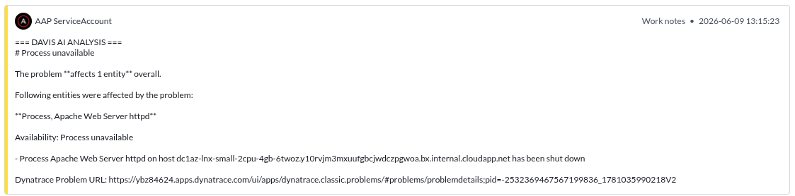

### Work Notes 3-4 — Service Restored (12:15:40 – 12:15:47 PM)

> Beginning automated remediation... Attempting service restoration for httpd.

> Service httpd restored. Website verified accessible (HTTP 200).

The automation's first priority is **restore the service**. Investigation
comes second. This mirrors what a good on-call engineer does — fix the
customer-facing problem first, then figure out why.

### Work Note 5 — Local Forensics (12:15:55 PM)

> **INVESTIGATION: Who stopped the service?**
>
> type=SERVICE_STOP msg=audit(06/09/2026 20:13:04): pid=1 uid=root
> unit=httpd comm=systemd exe=/usr/lib/systemd/systemd res=success
>
> **Stop request in system journal:**
>
> Jun 09 19:19:01 dc1az-lnx python3.9: ansible-ansible.builtin.systemd
> Invoked with name=httpd state=stopped
>
> **Users logged in at time of incident:**
>
> azureuser pts/0 2026-06-09 15:45

This is the forensic investigation. The two hardest questions after any
outage — *"What happened?"* and *"Who did it?"* — are answered automatically:

- The **audit log** shows the service was stopped by systemd (pid=1, root)
- The **journal** shows the stop was initiated by Ansible (`ansible.builtin.systemd`)
- The **login records** show who was on the system at the time

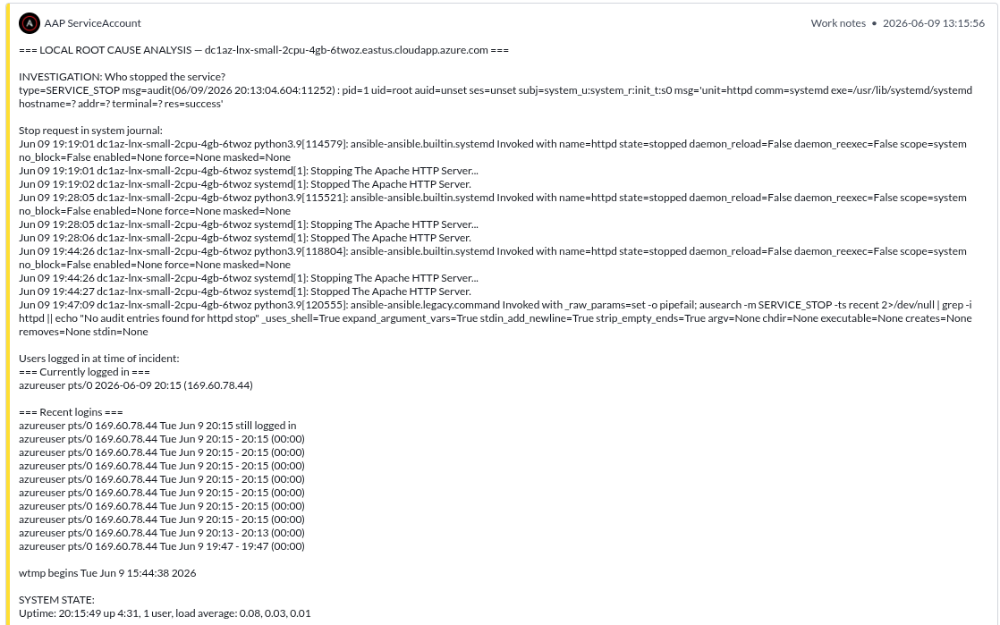

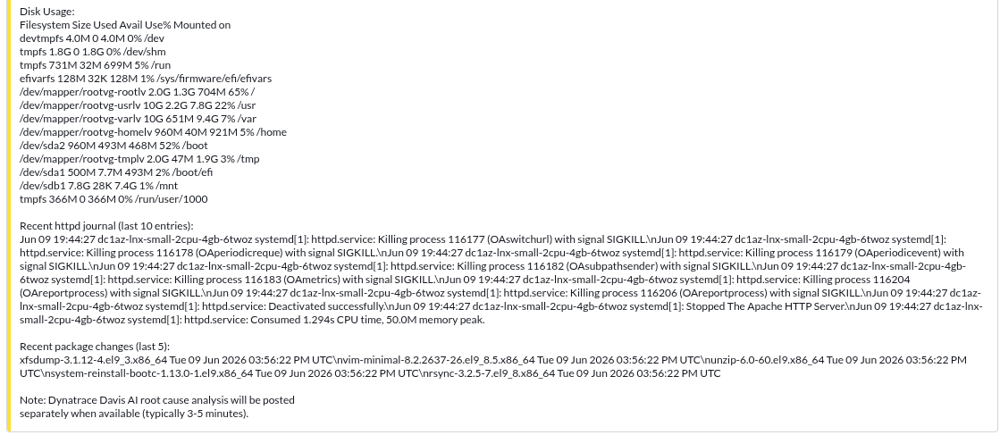

### Work Note 6 — Dynatrace Root Cause Analysis (12:16:11 PM)

> **Root Cause Entity:** Apache Web Server httpd
>
> **Evidence Items:** Availability, Process unavailable
>
> Dynatrace Problem URL: https://ybz84624.apps.dynatrace.com/ui/apps/...

Davis AI's root cause analysis — which entity it identified as the cause and
what evidence it used. This is Dynatrace's value: not just alerting, but
explaining *why*.

### Work Note 7 — Executive Summary (12:16:13 PM)

> **TRIAGE:** Checked CMDB, queried for change tickets, none found, incident
> created automatically.
>
> **REMEDIATION:** httpd restarted, website verified (HTTP 200).
>
> **DAVIS AI ROOT CAUSE ANALYSIS:** Root Cause Entity: Apache Web Server httpd.
>
> **LINKS:**
> - Dynatrace Problem: https://ybz84624.apps.dynatrace.com/...
> - AAP Workflow Job: https://aap-aap.apps.cluster-blsvm-2.../execution/jobs/workflow/691/output
>
> **RESOLUTION:** Service restored via automated remediation. All actions
> performed by Ansible Automation Platform.

The executive summary is the "read this one note" version. It links to both
the Dynatrace problem and the AAP workflow job — an auditor can click through
to either system for full details.

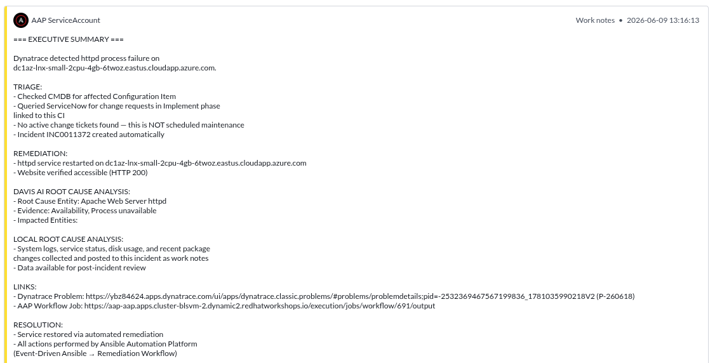

### Work Note 8 — Dynatrace Confirmation (12:17:39 PM)

> **DYNATRACE CONFIRMATION**
>
> Dynatrace has confirmed that problem P-260618 (Process unavailable) is now
> RESOLVED. The dc1az-lnx-small-2cpu-4gb-6twoz has recovered and is healthy.
> This confirms the automated remediation was successful.
>
> Full closed-loop: Detect → Remediate → Confirm
> (zero human intervention)

**This is the closed loop.** The fix isn't marked "done" just because the
automation says it restarted the service. An independent system (Dynatrace)
verified recovery and posted that confirmation. Three systems agree the
problem is fixed: Dynatrace (monitoring), Ansible (automation), ServiceNow
(record).

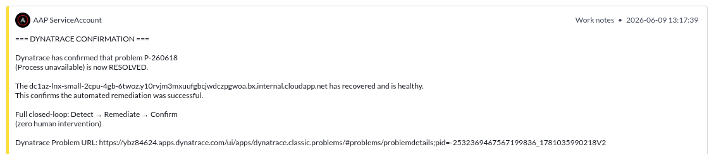

---

## The Before and After

### Before: Manual incident response

```
12:15 AM   Monitoring alert fires
12:20 AM   On-call engineer woken up by PagerDuty
12:25 AM   Engineer VPNs in, finds the alert
12:30 AM   SSH into the server, check what's wrong
12:35 AM   Restart httpd, verify website is back
12:40 AM   Check logs for what caused it
12:50 AM   Open ServiceNow ticket, write up what happened
 1:00 AM   Go back to sleep

Elapsed: 45 minutes.  Customer impact: 45 minutes.
On-call engineer: woken up for a service restart.
Audit trail: whatever the engineer remembered to write.
```

### After: Automated closed-loop response

```
12:15:00 PM   httpd stops
12:15:03 PM   Dynatrace detects, pushes to EDA
12:15:18 PM   Incident created, remediation starts
12:15:47 PM   Service restored, website verified
12:16:13 PM   Incident resolved with full audit trail
12:17:39 PM   Dynatrace confirms recovery

Elapsed: 2 minutes 48 seconds.  Customer impact: under 3 minutes.
On-call engineer: not paged. Reviews completed ticket in the morning.
Audit trail: 8 timestamped work notes with forensics, root cause, links.
```

---

## Why Should People Care?

### Mean Time to Restore drops from 45 minutes to under 3

In most organizations, a web server going down at 2 AM means: a monitoring
alert fires, someone gets paged, they wake up, VPN in, figure out which
server, SSH in, check logs, restart the service, verify it's back, write up
what happened, and update the ticket. That's 30-60 minutes if you're lucky —
and that's for a *simple* service restart.

Here, it took under 3 minutes with zero human involvement.

### The on-call engineer sleeps through the night

The service is restored before anyone even sees the alert. The humans review
the completed ticket in the morning — the forensic evidence is already there.
The on-call team shifts from *reactive firefighting* to *morning review*.

### Root cause analysis happens automatically

The two hardest questions after any outage are *"What happened?"* and *"Who
did it?"* Both are answered in the ticket:

- **Dynatrace Davis AI** identifies the root cause entity — which process,
  which component, what evidence led to that conclusion.
- **Local forensics** show exactly which user account or automation process
  stopped the service, who was logged in at the time, and what changed on
  the system recently.

No more "we don't know what happened" post-mortems.

### The monitoring system confirms the fix — not the person who applied it

This is critical for audit and compliance. The fix isn't marked "done" just
because the automation says it restarted the service. An **independent
system** (Dynatrace) verifies recovery and posts that confirmation to the
ticket.

That's the closed loop: **Detect → Remediate → Confirm.** Three independent
systems (Dynatrace, Ansible, ServiceNow) all agree the problem is fixed.

### Every action is auditable

The ServiceNow incident has timestamped work notes from every step. This is
the kind of documentation that organizations spend hours producing manually
after an incident — and here it's generated automatically, in real time, as
the work happens. Compliance teams, auditors, and change advisory boards get
the evidence they need without anyone writing a word.

### It scales without adding headcount

This isn't a script for one server. The same workflow handles Linux (Apache)
and Windows (IIS), any server monitored by Dynatrace. Add 100 servers, and
the automation handles all of them the same way. The humans focus on problems
that actually need human judgment — architecture decisions, capacity
planning, customer communication — not restarting a crashed web server at
2 AM.

### It knows when NOT to act

If there's an open change ticket on that server — someone is doing planned
maintenance — the system recognizes it and doesn't create an incident. It
logs the correlation to the change ticket instead: *"Dynatrace detected a
problem on this server. An active change ticket exists — this may be expected
maintenance. No incident created."*

That's the difference between automation and a script. It understands
context.

---

## The Architecture

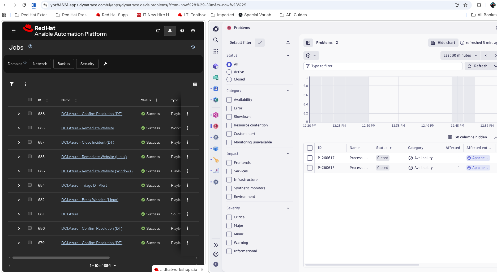

```
Dynatrace                 Event-Driven Ansible           ServiceNow
    |                            |                           |
    | Davis AI detects           |                           |
    | process failure            |                           |
    |   (~2 min)                 |                           |
    |                            |                           |
    |--- OPEN event ----------->|                           |
    |    (push, not poll)        |                           |
    |                            | Check: is there an        |
    |                            | open change ticket? ----->|
    |                            |                    <------|
    |                            | No change found.          |
    |                            | Create incident --------->|
    |                            |                           | INC created
    |                            |                           |
    |                            | Restart service           |
    |                            | Verify HTTP 200           |
    |                            | Gather forensics          |
    |                            | Post to incident -------->|
    |                            |                           | Work notes
    |                            |                           |
    |                            | Query DT Problems API     |
    |<-- root cause analysis ----|                           |
    |                            | Post RCA to incident ---->|
    |                            |                           | RCA + links
    |                            | Resolve incident -------->|
    |                            |                           | Resolved
    |                            |                           |
    | Davis AI confirms          |                           |
    | problem cleared            |                           |
    |   (~2-5 min later)         |                           |
    |                            |                           |
    |--- CLOSED event --------->|                           |
    |                            | Post confirmation ------->|
    |                            |                           | Confirmed
    |                            |                           |
    ====== CLOSED LOOP: Detect → Remediate → Confirm ========
```

**Key design choice: push, not poll.** Dynatrace pushes events to Ansible
the moment they happen. Ansible doesn't poll Dynatrace every N seconds
asking "anything wrong?" This means detection-to-action is measured in
seconds, not polling intervals.

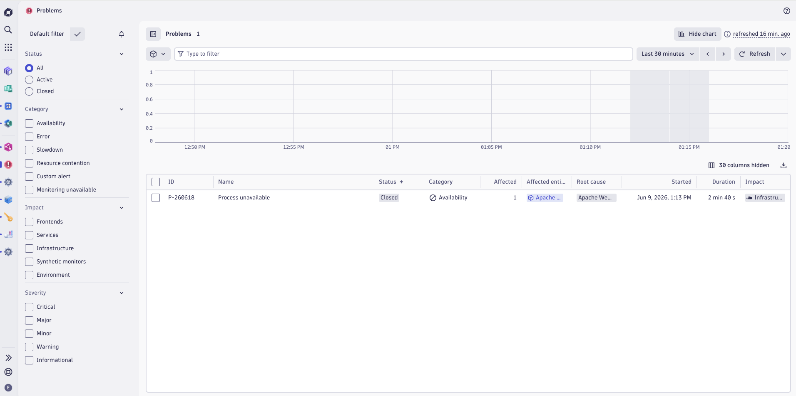

---

## The Technologies Working Together

| System | Role | What it did for INC0011372 |
|--------|------|---------------------------|
| **Dynatrace** | Monitoring + AI | Detected httpd failure in ~2 min, provided Davis AI root cause analysis, independently confirmed recovery |
| **Event-Driven Ansible** | Event routing | Received the push event, matched the OPEN rule, launched the remediation workflow — then matched the CLOSED rule for confirmation |
| **Ansible Automation Platform** | Orchestration | Ran the 4-node workflow: triage → remediate (Linux + Windows parallel) → close incident. Gathered forensics, posted all findings to ServiceNow |
| **ServiceNow** | System of record | CMDB lookup (is this server known?), change ticket check (is this planned?), incident lifecycle (create → work notes → resolve), audit trail |

No custom code. No middleware. No glue scripts. These are enterprise products
configured to work together through standard APIs and event-driven
architecture.

---

## The Bottom Line

*"We built a system where the monitoring tool, the automation platform, and
the ticketing system work together without human intervention. When a service
fails, it's detected in under two minutes, restored in under three, and the
incident ticket documents everything — the root cause, the forensics, who
did it, and an independent confirmation that the fix worked. Our on-call team
reviews the completed ticket instead of being woken up to do the work."*

---

## Common Questions

**Q: What if the automated fix doesn't work?**
A: The workflow verifies the fix (HTTP 200 check). If the service doesn't
come back, the incident stays open with all the forensic data already
collected — the on-call engineer starts with evidence, not from scratch.

**Q: What about more complex failures?**
A: This handles the high-volume, low-complexity incidents — the ones that
wake people up at 2 AM for a service restart. Complex failures (data
corruption, cascading outages, capacity exhaustion) still need human
judgment. The point is to free those humans from the simple ones so they
can focus on the hard problems.

**Q: How do we know the automation won't make things worse?**
A: Three safeguards: (1) It checks for active change tickets before acting —
if maintenance is in progress, it stands down. (2) It verifies the fix
worked before marking it resolved. (3) Dynatrace independently confirms
recovery — if the fix didn't hold, Davis would open a new problem and the
cycle would repeat.

**Q: What does this cost?**
A: The components are Red Hat Ansible Automation Platform (automation),
Dynatrace (monitoring), and ServiceNow (ticketing) — all enterprise tools
most large organizations already own. The integration is configuration, not
custom code. The real cost question is: what does a 45-minute outage cost
you at 2 AM, multiplied by how often it happens?

**Q: Can we extend this to other services?**
A: Yes. The workflow is service-agnostic — it handles any process Dynatrace
monitors. Adding a new service means adding a Dynatrace monitoring rule and
a remediation playbook. The triage logic (CMDB lookup, change ticket check,
incident creation) is reusable as-is.

**Q: What about Windows?**
A: The same workflow handles both Linux (Apache/httpd) and Windows (IIS).
The triage node detects the OS from the hostname, and the remediation runs
the correct playbook for each. Both paths run in parallel — if you have
both a Linux and Windows server down, they're both remediated simultaneously.

**Q: How long did this take to build?**
A: The integration is configuration — Dynatrace Workflow pushing to an AAP
Event Stream, a rulebook matching events, and playbooks calling ServiceNow
APIs. No custom application code. The heavy lifting is done by the platforms
themselves. What you're seeing is what happens when enterprise tools are
connected properly.

---

## Screenshots

All screenshots captured from the live validation run (INC0011372 / P-260618,
June 9, 2026). Stored in `docs/images/`.

| Screenshot | Content |
|------------|---------|
| [](images/demo-13-dt-problem-active.png) | Dynatrace Problems — P-260618 Active alongside AAP jobs |
| [](images/demo-14-aap-remediation-workflow.png) | AAP workflow graph: triage → remediate → close |
| [](images/demo-15a-inc-header.png) | INC0011372 header: CI, description, DT URL, Davis narrative |
| [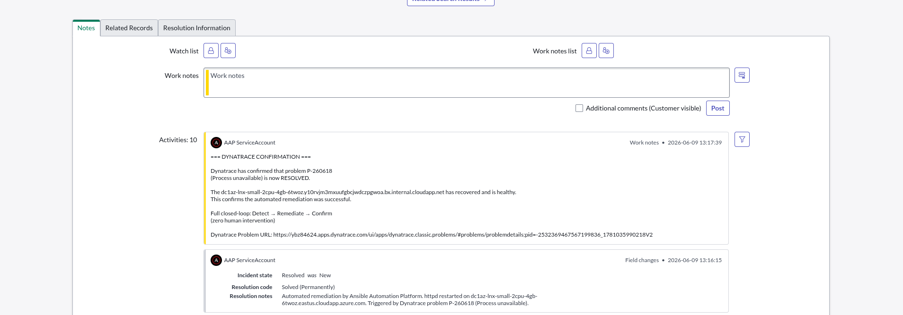](images/demo-15b-inc-confirmation-and-resolution.png) | DT Confirmation + resolution field changes |
| [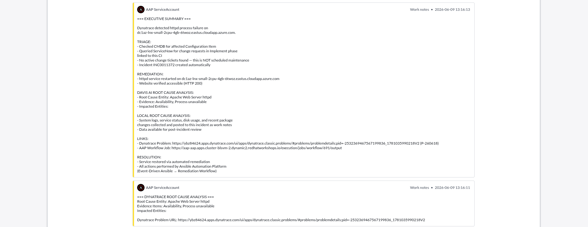](images/demo-15c-inc-executive-summary.png) | Executive summary + DT RCA work notes |
| [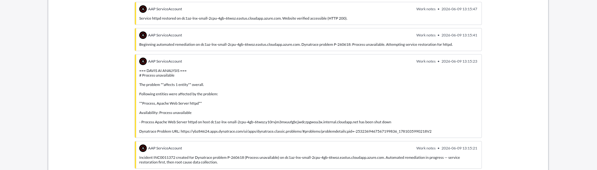](images/demo-15d-inc-remediation-notes.png) | Service restored, remediation start, Davis AI, creation |
| [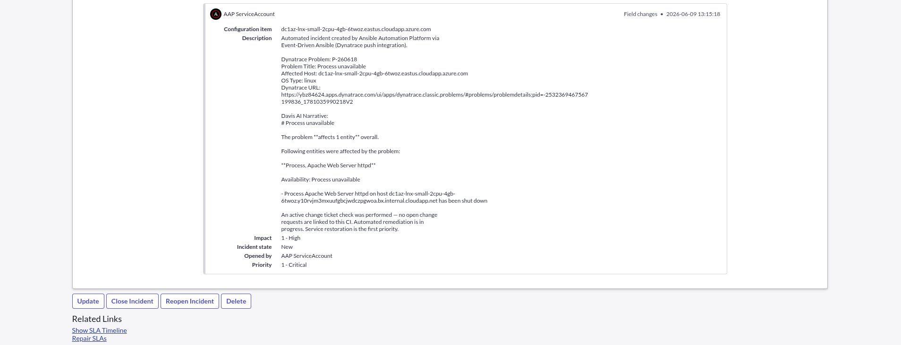](images/demo-15e-inc-creation-details.png) | Incident creation field changes — CI, Priority 1-Critical |
| [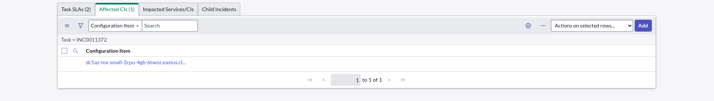](images/demo-15f-inc-affected-cis.png) | Affected CIs tab — linked CMDB CI |
| [](images/demo-16-inc-davis-narrative.png) | Close-up: Davis AI Analysis work note |
| [](images/demo-17a-inc-rca-forensics.png) | Close-up: Local RCA — investigation + who stopped it |
| [](images/demo-17b-inc-rca-forensics.png) | Close-up: Local RCA — system state + disk + journal |
| [](images/demo-18-inc-executive-summary.png) | Close-up: Executive Summary with DT + AAP links |
| [](images/demo-19-dt-problem-closed.png) | Dynatrace Problems — P-260618 Closed, root cause identified |
| [](images/demo-20-inc-dt-confirmation.png) | Close-up: Dynatrace Confirmation work note |

---

*Last validated: June 9, 2026 — INC0011372 / P-260618 on RHDP env blsvm.*
