# ServiceNow → AAP Event-Driven Ansible — Integration How-To

A step-by-step guide to wire **ServiceNow** to **Ansible Automation Platform (AAP)**
using **Event-Driven Ansible (EDA)**, so a ServiceNow catalog order (or an incident)
automatically launches an AAP workflow, and AAP writes the result back into ServiceNow.

This guide covers **both sides** — the AAP side as Config-as-Code (CaC) you can lift into
your own repo, and the ServiceNow side click-by-click — plus the **encrypted bearer-token**
security model that keeps the secret out of plaintext.

> **Audience:** a Red Hat Solution Architect or a customer admin rebuilding this in their
> own environment. The worked example is Red Hat's `dc1.azure` Windows demo, but every
> name, URL, and token is shown as a `REPLACE_ME_*` placeholder so you can drop in your
> own values.

---

## Contents

1. [What you'll build](#1-what-youll-build)
2. [Prerequisites](#2-prerequisites)
3. [Architecture](#3-architecture)
4. [The security model: the encrypted bearer token (read this first)](#4-the-security-model-the-encrypted-bearer-token-read-this-first)
5. [Part A — AAP / EDA side (Config-as-Code)](#5-part-a--aap--eda-side-config-as-code)
6. [Part B — ServiceNow side](#6-part-b--servicenow-side)
7. [Verify end-to-end](#7-verify-end-to-end)
8. [Gotchas (so you don't hit them)](#8-gotchas-so-you-dont-hit-them)
9. [Reference links](#9-reference-links)

---

## 1. What you'll build

A business user orders a VM from the ServiceNow self-service catalog. After approval,
ServiceNow fires an event to AAP, EDA decides which workflow to run, AAP provisions the
VM, and then AAP calls ServiceNow back to update the request item (RITM) and CMDB.

Two trigger patterns are documented:

| Pattern | ServiceNow source | AAP workflow it launches |
|---------|-------------------|--------------------------|
| **Catalog request → provision** | A `sc_req_item` (RITM) reaches *Request Approved* | a provisioning workflow (e.g. `DC1.Azure - Provision and Configure`) |
| **Incident → remediate** | An `incident` is created against a CI you manage | a remediation workflow (e.g. `Lightspeed Patching - Remediate CVE`) |

Both patterns use the **same plumbing**: a ServiceNow Business Rule → an Outbound REST
Message → an AAP EDA **event stream** → an EDA **rulebook** that matches the payload and
runs a workflow.

---

## 2. Prerequisites

- **AAP 2.5+** with **Event-Driven Ansible / Automation Decisions** enabled.
- A **git repository** AAP can reach (to hold the EDA rulebook) and a credential to clone it.
- A **ServiceNow instance** with admin rights (to create catalog items, REST Messages,
  Business Rules, System Properties, and a Flow Designer flow).
- The **`infra.aap_configuration`** and **`ansible.eda`** collections (for the CaC in Part A).
- A workflow (or job) template in AAP that actually does the work you want to trigger.
  This guide assumes it already exists — it triggers *your* workflow; it doesn't build it.
- A **ServiceNow service account** for the callbacks (AAP → ServiceNow). You'll set its
  host/user/password as `SN_HOST` / `SN_USERNAME` / `SN_PASSWORD` (see §5.7 and §6.8).

---

## 3. Architecture

```
+-- ServiceNow ------------------------------------------------------------+
|                                                                          |
| 1. User orders catalog item --> 2. Flow Designer: Ask for Approval       |
|    (or: an Incident is                      |                            |
|     created against a CI)                   v   (approved)               |
|                                   RITM stage = "Request Approved"        |
|                                             |                            |
|                                             v                            |
| 3. Business Rule fires --> reads encrypted token (gs.getProperty)        |
|      --> builds JSON payload --> Outbound REST Message POST              |
|          (Authorization: Bearer <token>)                                 |
+-------------------------------------------+------------------------------+
                                            |  HTTPS POST
                                            v
+-- AAP (Event-Driven Ansible) --------------------------------------------+
| 4. Event stream receives the POST, validates the bearer token            |
| 5. Rulebook activation: matches payload.short_description                |
|      --> action: run_workflow_template                                   |
| 6. Workflow runs (provision / remediate) --> emits set_stats facts       |
| 7. Callback job templates POST back to ServiceNow:                       |
|      update RITM (state + work notes), create CMDB CI, Incident          |
+-------------------------------------------+------------------------------+
                                            |  servicenow.itsm modules
                                            v
+-- ServiceNow ------------------------------------------------------------+
| 8. RITM --> Closed Complete, CMDB CI created & linked (or Incident)      |
+--------------------------------------------------------------------------+
```

The key design choice: **ServiceNow holds no workflow ID and no launch-scoped AAP token** —
only the event-stream URL and a bearer token. **EDA decides which workflow runs**, by
matching on the payload's `short_description`. One ingress can serve every ServiceNow-driven
automation.

---

## 4. The security model: the encrypted bearer token (read this first)

> **Two credentials, two directions.** This integration authenticates in **both**
> directions, with **separate** credentials:
> 1. **Inbound — ServiceNow → AAP** (this section): a shared **bearer token** that secures
>    the EDA event-stream POST.
> 2. **Outbound — AAP → ServiceNow** (the callbacks that update the RITM / CMDB / incident):
>    a ServiceNow **service account** (host + user + password), held in an AAP credential of
>    a custom type. See **§5.7** (AAP credential type + instance) and **§6.8** (creating the
>    ServiceNow service account).
>
> They are independent — different secrets, different jobs. This section is the inbound token.

The single shared secret on the **inbound** path is a **bearer token**. Get this right and the
rest is plumbing; get it wrong and you'll see `401`s.

### What the token is

It is **not** issued by AAP or ServiceNow. **You mint it yourself** — a long random string:

```bash
openssl rand -hex 32
```

It is a **matched pair**: the *exact same value* must be stored on both sides. The #1 cause
of a `401` is a **trailing newline** when pasting it.

### Where it lives on the **AAP** side

In an EDA **credential** whose type is `ServiceNow Event Stream` (or the generic
`Token Event Stream`). AAP uses it to authenticate inbound POSTs to the event stream:

```yaml
auth_type: token
http_header_key: Authorization      # AAP expects: Authorization: Bearer <token>
token: "{{ eda_event_stream_token }}"
```

### Where it lives on the **ServiceNow** side (the important bit)

**Not** as a header on the Outbound REST Message — that would sit in plaintext in the REST
Message record. Instead it lives in an **encrypted System Property**:

- **Table:** System Properties (`sys_properties`)
- **Name:** `REPLACE_ME_PREFIX.eda_event_stream_token` (e.g. `dc1.eda_event_stream_token`)
- **Type:** `password2 (Encrypted)` — stored encrypted at rest; the raw value is never
  visible in the property list or in the REST Message config.

The Business Rule reads it **at send time** and injects it into the header itself:

```javascript
r.setRequestHeader('Authorization', 'Bearer ' + gs.getProperty('REPLACE_ME_PREFIX.eda_event_stream_token'));
```

`gs.getProperty()` returns the **decrypted** value server-side, so the cleartext token
exists only transiently in memory during the POST. The Outbound REST Message therefore
carries **only** a `Content-Type: application/json` header — no token at all.

### Rotating the token

Update **both** sides together, or the event stream will `401`:

1. Mint a new value: `openssl rand -hex 32`.
2. ServiceNow: set the `…eda_event_stream_token` property's **Value** (no trailing newline).
3. AAP: update the `ServiceNow Event Stream` credential's **Token** to the same value.
4. Place a test order and confirm `HTTP 200`.

---

## 5. Part A — AAP / EDA side (Config-as-Code)

All of the AAP objects are defined as data and applied with the
[`infra.aap_configuration`](https://github.com/redhat-cop/infra.aap_configuration/tree/release/4.6.1)
collection's roles. The snippets below are copy-paste-ready — replace the `REPLACE_ME_*`
placeholders and the `{{ … }}` variables with your own.

> The worked example pins `infra.aap_configuration: 4.4.0` in
> [`collections/requirements.yml`](https://github.com/ericcames/dc1.azure/blob/main/collections/requirements.yml); the
> [`release/4.6.1`](https://github.com/redhat-cop/infra.aap_configuration/tree/release/4.6.1)
> branch is the current stream — pin whichever version you validate against.

### 5.1 Pin the collections

`collections/requirements.yml`:

```yaml
---
collections:
  - name: infra.aap_configuration
    version: 4.6.1            # pin to the version you validate against
  - name: ansible.eda         # EDA modules: rulebook_activation, event streams, etc.
  - name: servicenow.itsm     # used by the AAP→ServiceNow callback playbooks (Part B context)
```

The EDA-creating roles you'll use (all under `infra.aap_configuration`):
[`eda_credentials`](https://github.com/redhat-cop/infra.aap_configuration/tree/release/4.6.1/roles/eda_credentials),
[`eda_projects`](https://github.com/redhat-cop/infra.aap_configuration/tree/release/4.6.1/roles/eda_projects),
[`eda_event_streams`](https://github.com/redhat-cop/infra.aap_configuration/tree/release/4.6.1/roles/eda_event_streams),
[`eda_rulebook_activations`](https://github.com/redhat-cop/infra.aap_configuration/tree/release/4.6.1/roles/eda_rulebook_activations),
applied together via the
[`dispatch`](https://github.com/redhat-cop/infra.aap_configuration/tree/release/4.6.1/roles/dispatch)
role.

### 5.2 The rulebook (lives in your git repo)

This is the brain of the integration — it listens for events and decides which workflow to
run. See the worked example at
[`rulebooks/servicenow_events.yml`](https://github.com/ericcames/dc1.azure/blob/main/rulebooks/servicenow_events.yml).

```yaml
---
- name: Listen for approved requested items from ServiceNow
  hosts: all
  sources:
    - ansible.eda.webhook:          # an unnamed source; EDA auto-names it __SOURCE_1
        host: 0.0.0.0
        port: 5000

  rules:
    - name: Run the provision-and-configure workflow
      # The match string is injected from CaC (extra_vars) so the condition lives in code.
      condition: event.payload.short_description == vars.my_catalog_short_description
      action:
        run_workflow_template:
          name: "REPLACE_ME_WORKFLOW_NAME"          # e.g. "DC1.Azure - Provision and Configure"
          organization: "{{ my_organization }}"     # REQUIRED — without it the action errors
          job_args:
            extra_vars:
              ticket_number: "{{ event.payload.number }}"
              ticket_sys_id: "{{ event.payload.sys_id }}"
              os_type: "{{ event.payload.os_type | default('windows') }}"
              vm_size_tier: "{{ event.payload.vm_size_tier }}"
```

> **Why `organization` is needed:** the `run_workflow_template` action resolves the workflow
> within an org; if `my_organization` isn't passed in via the activation's `extra_vars`, the
> rulebook errors *"'my_organization' is undefined"* and nothing launches.

For the **incident** pattern, add a second rulebook (e.g.
`rulebooks/servicenow_incident_events.yml`) that matches on an incident field and runs your
remediation workflow:

```yaml
---
- name: Listen for ServiceNow incidents
  hosts: all
  sources:
    - ansible.eda.webhook:
        host: 0.0.0.0
        port: 5000
  rules:
    - name: Remediate on incident
      condition: event.payload.event == "CVE_INCIDENT"   # match a field your BR sets
      action:
        run_workflow_template:
          name: "REPLACE_ME_REMEDIATION_WORKFLOW"
          organization: "{{ my_organization }}"
          job_args:
            extra_vars:
              incident_number: "{{ event.payload.number }}"
              incident_sys_id: "{{ event.payload.sys_id }}"
              affected_hosts: "{{ event.payload.cmdb_ci | default('') }}"
```

### 5.3 EDA credentials

See [`aap_config/files/eda_credentials.yml`](https://github.com/ericcames/dc1.azure/blob/main/aap_config/files/eda_credentials.yml).

```yaml
eda_credentials:
  # Lets the rulebook launch a Controller workflow (run_workflow_template).
  - name: "REPLACE_ME_CONTROLLER_CRED"
    organization: "{{ my_organization }}"
    credential_type: "Red Hat Ansible Automation Platform"
    inputs:
      host: "REPLACE_ME_AAP_HOST/api/controller/"
      username: "REPLACE_ME_USER"
      password: "REPLACE_ME_PASSWORD"
      verify_ssl: false

  # The shared bearer token (matched pair with the ServiceNow encrypted property).
  - name: "REPLACE_ME_EVENT_STREAM_CRED"
    organization: "{{ my_organization }}"
    credential_type: "ServiceNow Event Stream"   # or the generic "Token Event Stream"
    inputs:
      auth_type: token
      http_header_key: Authorization
      token: "{{ eda_event_stream_token }}"       # from an env var / vault — never hard-code

  # Lets the EDA project clone your rulebook repo.
  - name: "REPLACE_ME_SCM_CRED"
    organization: "{{ my_organization }}"
    credential_type: "Source Control"
    inputs:
      username: "REPLACE_ME_GIT_USER"
      password: "REPLACE_ME_GIT_TOKEN"
```

### 5.4 EDA project, event stream, and rulebook activation

Project — [`aap_config/files/eda_projects.yml`](https://github.com/ericcames/dc1.azure/blob/main/aap_config/files/eda_projects.yml):

```yaml
eda_projects:
  - name: "REPLACE_ME_EDA_PROJECT"
    url: "REPLACE_ME_GIT_URL"
    scm_branch: main
    credential: "REPLACE_ME_SCM_CRED"
    organization: "{{ my_organization }}"
    sync: true
```

Event stream — [`aap_config/files/eda_event_streams.yml`](https://github.com/ericcames/dc1.azure/blob/main/aap_config/files/eda_event_streams.yml).
This is the inbound ingress; its **URL** is what ServiceNow POSTs to:

```yaml
eda_event_streams:
  - name: "REPLACE_ME_EVENT_STREAM"
    credential_name: "REPLACE_ME_EVENT_STREAM_CRED"   # the token credential above
    organization: "{{ my_organization }}"
    forward_events: true
```

Rulebook activation — [`aap_config/files/eda_rulebook_activations.yml`](https://github.com/ericcames/dc1.azure/blob/main/aap_config/files/eda_rulebook_activations.yml).
This binds the rulebook + event stream + decision environment + credentials:

```yaml
eda_rulebook_activations:
  - name: "REPLACE_ME_ACTIVATION"
    project: "REPLACE_ME_EDA_PROJECT"
    organization: "{{ my_organization }}"
    rulebook: servicenow_events.yml
    decision_environment: "Default Decision Environment"
    extra_vars:
      my_organization: "{{ my_organization }}"
      my_catalog_short_description: "REPLACE_ME_SHORT_DESCRIPTION"
    # Bind the event stream to the rulebook's first (unnamed) source __SOURCE_1.
    event_streams:
      - event_stream: "REPLACE_ME_EVENT_STREAM"
        source_name: __SOURCE_1
    eda_credentials:
      - "REPLACE_ME_CONTROLLER_CRED"
    state: present
```

> **Idempotency note:** the `ansible.eda.rulebook_activation` module declares `extra_vars`
> as a *string* and EDA stores it as block YAML. Passing a dict (as above) works on some
> versions, but if you find the activation re-applies on every run — and EDA rejects updates
> to a *running* activation — switch `extra_vars` to a literal block string instead:
> ```yaml
> extra_vars: |
>   my_organization: {{ my_organization }}
>   my_catalog_short_description: REPLACE_ME_SHORT_DESCRIPTION
> ```

### 5.5 Apply it

The CaC reads its secrets from **environment variables** at load time (the bearer token,
the Controller/SCM credentials, and the ServiceNow service-account creds — `EDA_EVENT_STREAM_TOKEN`,
`SN_HOST`/`SN_USERNAME`/`SN_PASSWORD`, etc.). **Export them and run `ansible-playbook` in the
*same* shell invocation** — env vars do not carry across separate shells, and if they're
unset the credentials load empty:

```bash
source <your-secrets-file>.sh   # e.g. `source docs/dev-environment.sh` (gitignored)
ansible-playbook -i aap_config/inventory/ aap_config/load.yml \
  2>&1 | tee /tmp/load-$(date +%Y%m%d-%H%M%S).log
```

### 5.6 Copy the event-stream URL

After the event stream exists, get its external URL from the AAP UI —
**Automation Decisions → Event Streams → _your stream_ → URL**. It looks like:

```
https://REPLACE_ME_AAP_HOST/eda-event-streams/api/eda/v1/external_event_stream/<stream-uuid>/post/
```

You'll paste this into the ServiceNow Outbound REST Message (Part B).

The Event Stream **Details** page shows the **URL** (copy it here — redacted in this
example) and an **events-received** counter that increments on each ServiceNow POST:

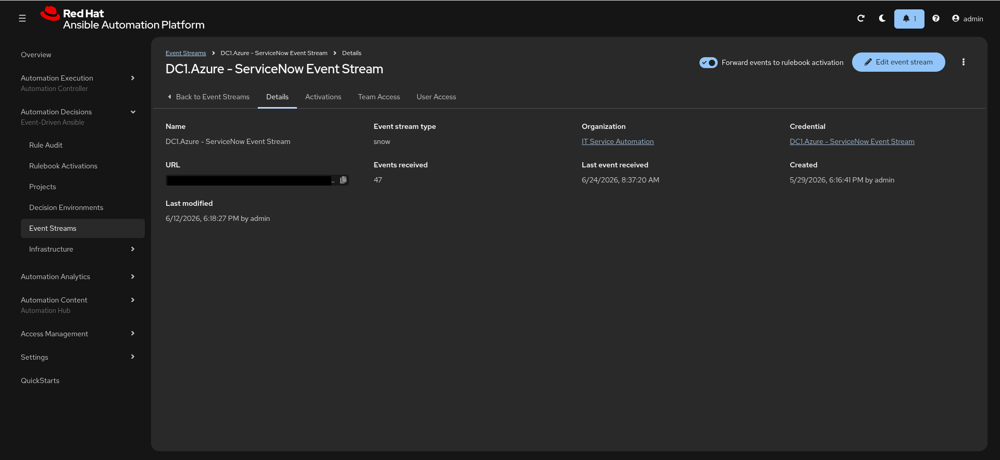

The **Rulebook Activation** should show status **Running** (here, *DC1.Azure - Catch
ServiceNow Events*):

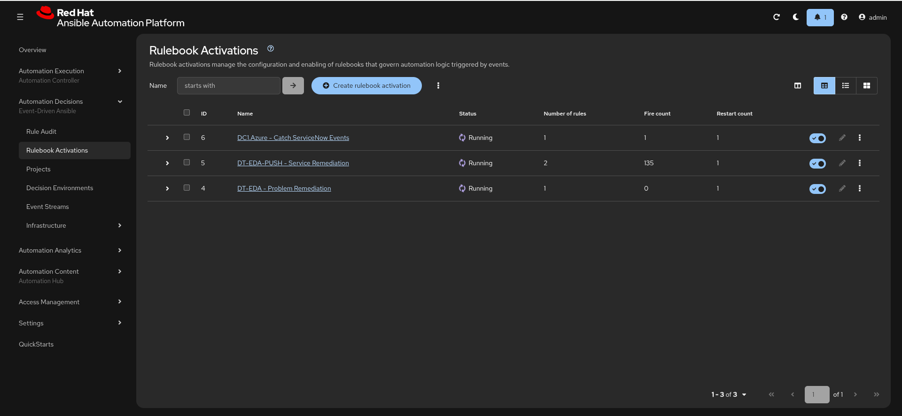

### 5.7 AAP → ServiceNow callback credential (custom credential type)

Everything above is the **inbound** path. The **outbound** path — where AAP writes back to
ServiceNow (updates the RITM, creates the CMDB CI, opens an incident on failure) — needs AAP
to authenticate to ServiceNow as a **service account** (§6.8). AAP carries those creds in a
**custom credential type** that injects them as environment variables the `servicenow.itsm`
modules read automatically.

**Step 1 — define the custom credential type** (`aap_config/files/controller_credential_types.yml`).
The `injectors.env` block is the key: it turns the credential's fields into `SN_HOST` /
`SN_USERNAME` / `SN_PASSWORD` for any job that uses the credential:

```yaml
controller_credential_types:
  - name: ServiceNow ITSM Credential
    description: ServiceNow ITSM Credential
    inputs:
      fields:
        - id: instance
          type: string
          label: Instance
        - id: username
          type: string
          label: username
        - id: password
          type: string
          label: password
          secret: true            # stored encrypted; write-only in the UI
      required:
        - instance
        - username
        - password
    injectors:
      env:
        SN_HOST: !unsafe '{{instance}}'
        SN_USERNAME: !unsafe '{{username}}'
        SN_PASSWORD: !unsafe '{{password}}'
```

> `!unsafe` stops Ansible from templating `{{instance}}` etc. at load time — they must reach
> AAP literally so AAP substitutes the credential's values at job run time.

**Step 2 — create the credential instance** of that type
(`aap_config/files/controller_credentials.yml`). The inputs come from env vars (your
gitignored secrets file), never hard-coded:

```yaml
controller_credentials:
  - name: "REPLACE_ME_SNOW_CRED"          # e.g. "DC1.Azure - ServiceNow"
    organization: "{{ my_organization }}"
    credential_type: "ServiceNow ITSM Credential"
    inputs:
      instance: "{{ lookup('ansible.builtin.env', 'SN_HOST') }}"
      username: "{{ lookup('ansible.builtin.env', 'SN_USERNAME') }}"
      password: "{{ lookup('ansible.builtin.env', 'SN_PASSWORD') }}"
```

> **Ordering matters:** apply the **credential type before the credential instance** — the
> instance references the type by name. In the worked example, `load.yml` lists
> `controller_credential_types.yml` immediately before `controller_credentials.yml` in its
> `vars_files`.

**Step 3 — attach the credential to the callback job templates.** Any JT that runs a
`playbooks/servicenow/*.yml` callback (RITM update, CMDB CI, incident) gets this credential;
its `injectors` then expose `SN_HOST`/`SN_USERNAME`/`SN_PASSWORD` to the `servicenow.itsm`
modules with **no auth parameters in the tasks**. (`SN_HOST` is the instance URL,
`https://your-instance.service-now.com`.)

The AAP **Credential Type** — the Input fields and the **Injector configuration** that maps
them to `SN_HOST`/`SN_USERNAME`/`SN_PASSWORD`:

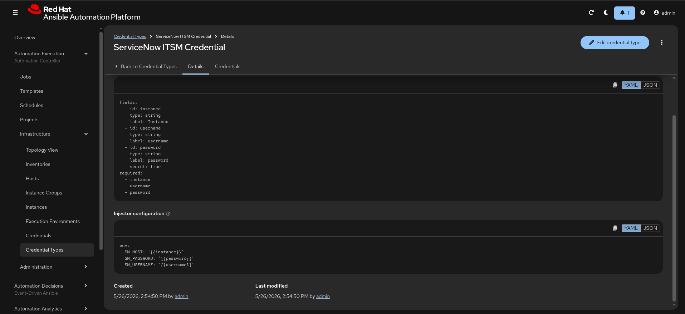

The **credential instance** of that type — Host and Username are visible; the password is
write-only (shows `ENCRYPTED`). The instance URL is redacted here:

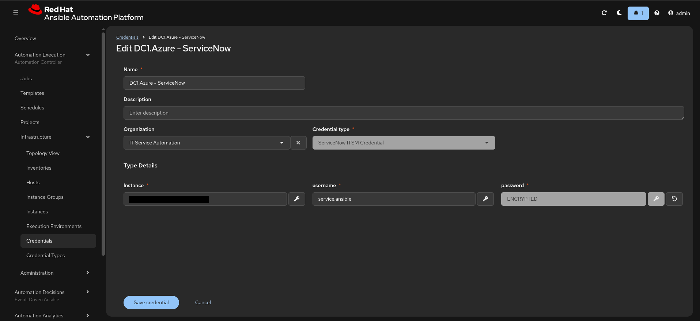

---

## 6. Part B — ServiceNow side

Build these in order. Placeholders: `REPLACE_ME_PREFIX` (e.g. `dc1`), the event-stream URL
from §5.6, and the bearer token from §4.

> 📸 **Screenshots** (✅ = included below; ⬜ = still to capture):
> 1. ✅ The **catalog item** form (Name, Short description) — §6.1.
> 2. ✅ The **`os_type`** and **`vm_size_tier`** variables and their choice values — §6.1.
> 3. ✅ The catalog item's **Flow** field pointing at the Flow Designer flow — §6.2.
> 4. ✅ The Flow Designer flow: the **Service Catalog trigger** and the **Ask for Approval** action — §6.2.
> 5. ✅ The encrypted **System Property** form showing **Type = `password2`** — §6.3.
> 6. ✅ The **Outbound REST Message** form (endpoint + the single `Content-Type` header) — §6.4.
> 7. ✅ The **catalog Business Rule** *When to run* tab — §6.5.
> 8. ✅ The Business Rule **Advanced → Script** tab — §6.5.
> 9. ✅ The **incident Business Rule** *When to run* tab — §6.6.
> 10. ✅ A finished **RITM** showing the AAP-written work notes (FQDN/IP) and *Closed Complete* — §7.
> 11. ✅ The AAP **custom credential type** (inputs + injectors) — §5.7.
> 12. ✅ The AAP **ServiceNow credential** instance — §5.7.
> 13. ✅ The ServiceNow **service-account** user record — §6.8.

### 6.1 Create the catalog item (build from scratch)

1. **Service Catalog → Catalog Definitions → Maintain Items → New.**
2. Set **Name** (e.g. `Request Infrastructure (Azure)`) and a **Catalog**/**Category** so
   users can find it.
3. **Short description** — this is the **trigger key**. It must match the rulebook's
   `my_catalog_short_description` **byte-for-byte** (no trailing space). Example:
   `REPLACE_ME_SHORT_DESCRIPTION` (e.g. `DC1.Azure Infrastructure Provisioning`).
4. (Optional) upload an icon on the catalog item form.

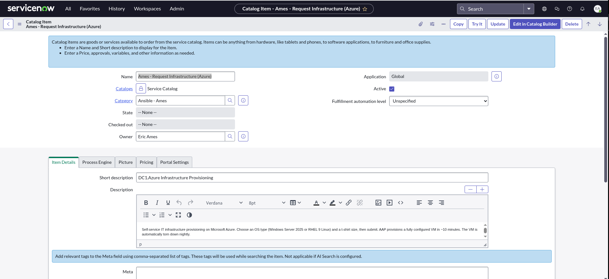

Add the two variables (**Catalog item → Variables → New**):

| Variable | Type | Choices | Default |
|----------|------|---------|---------|
| `os_type` | Multiple Choice | `windows`, `linux`, `both` | `windows` |
| `vm_size_tier` | Multiple Choice | `small-2cpu-4gb`, `medium-2cpu-8gb`, `large-4cpu-16gb` | `medium-2cpu-8gb` |

The catalog item's **Variables** related list — both variables defined as *Multiple Choice*:

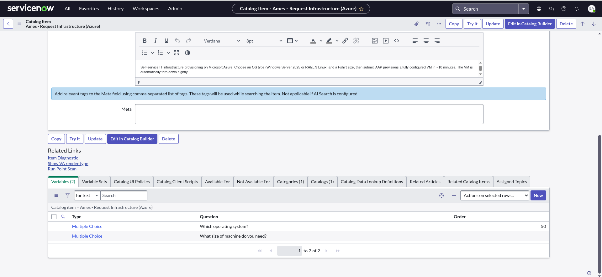

Each variable's **Name** must be exactly `os_type` / `vm_size_tier` (the rulebook and the
Business Rule reference these), and the **Question Choices** values must match what the
workflow survey expects:

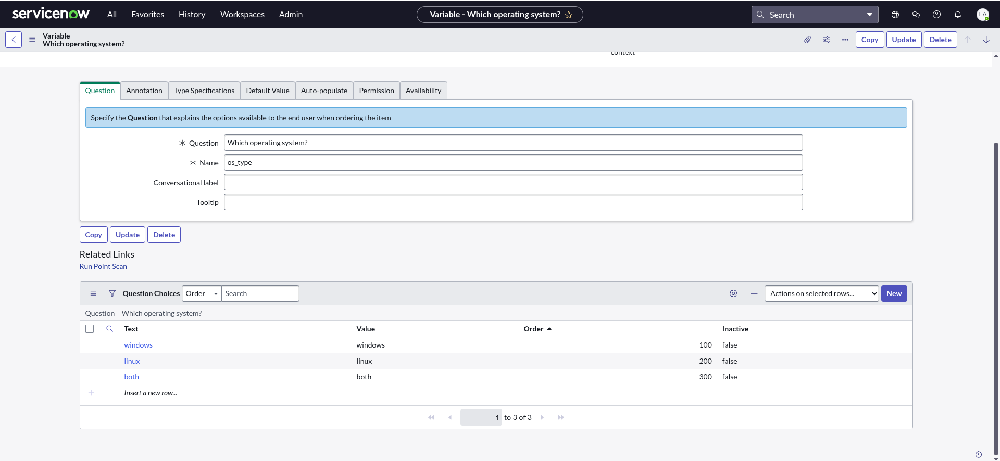

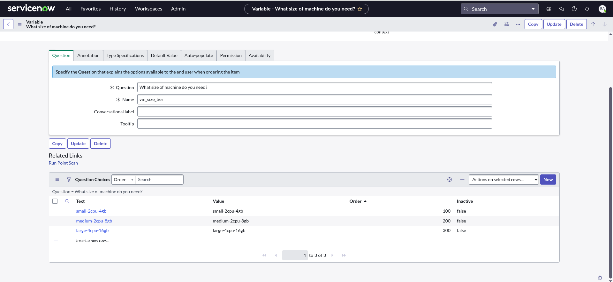

> The worked example also ships
> [`playbooks/servicenow/update_catalog_item.yml`](https://github.com/ericcames/dc1.azure/blob/main/playbooks/servicenow/update_catalog_item.yml)
> to edit the item's text fields via the Table API once it exists.

### 6.2 Fulfillment & approval — Flow Designer

The catalog Business Rule (§6.5) only fires once the RITM reaches
**stage = `Request Approved`, state = `Work in Progress`**. Something has to drive the
request there. You have two options.

#### Option A (recommended, as-built): a Flow Designer approval flow

Build a flow with a **Service Catalog trigger** and three actions —
*Get Catalog Variables → Ask For Approval → Update Requested Item Record*:

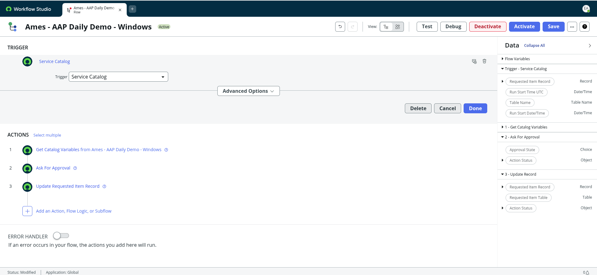

1. **All → Flow Designer → New → Flow.** Name it (e.g. `Request Infrastructure approval`).
2. **Trigger: Service Catalog** — select your catalog item; the flow runs when the item is
   requested.
3. **Action 1 — Get Catalog Variables** (optional but handy): pull the request's variables
   (`os_type`, `vm_size_tier`) so later steps can reference them.
4. **Action 2 — Ask For Approval** on the *Requested Item* (`sc_req_item`). Set the
   **Approval Field** to `Approval` and a rule of **Approve / Anyone approves**, pointing at
   an approver or a group. With *Anyone approves*, the first approval satisfies the step and
   the rest become *No Longer Required*. On rejection the RITM closes *Closed Incomplete* and
   nothing fires.

   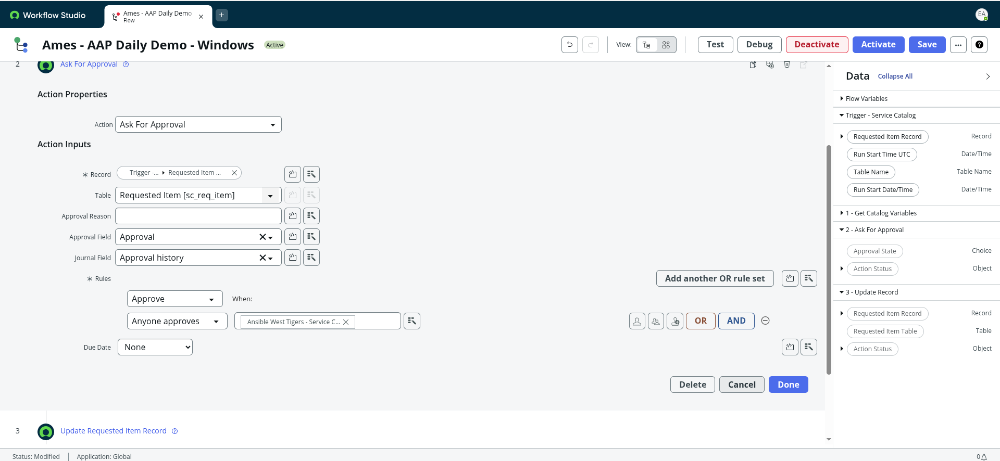

5. **Action 3 — Update Requested Item Record:** set **State = Work in Progress**. This —
   together with the granted approval (which puts the RITM at the *Request Approved* stage) —
   is exactly the condition the catalog Business Rule (§6.5) keys on
   (`stage=request_approved ^ state=Work in Progress`).

   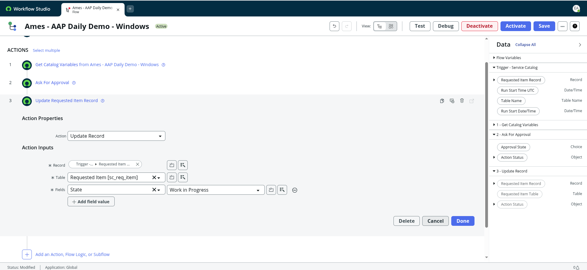

6. **Attach the flow to the catalog item:** open the catalog item → **Process Engine** tab →
   set its **Flow** field (`flow_designer_flow`) to this flow. Make sure the item has **no**
   legacy *Workflow* set (Flow and legacy Workflow are mutually exclusive).

The catalog item's **Process Engine** tab — **Flow** set, legacy **Workflow** empty:

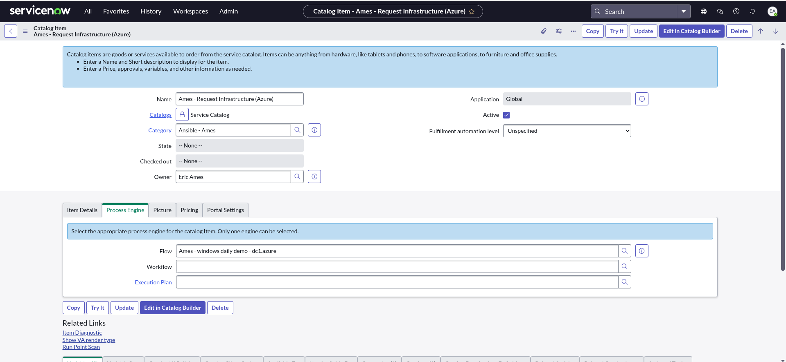

#### Option B (simplest demo path): no approval

Skip Flow Designer entirely and fire the Business Rule **on insert** instead of on the
approved stage. Easiest to reproduce on an empty instance, but there's **no approval gate**
— every order provisions immediately. If you choose this, set the Business Rule (§6.5) to
**Insert = true** and drop the `stage`/`state` filter conditions.

### 6.3 Encrypted token property

**All → System Properties (`sys_properties`) → New:**

- **Name:** `REPLACE_ME_PREFIX.eda_event_stream_token`
- **Type:** `password2 (Encrypted)`
- **Value:** the bearer token from §4 (the same value as the AAP credential). **No trailing
  newline.**

This is the matched pair with the AAP `ServiceNow Event Stream` credential. See §4 for the
full rationale.

The property form — **Type = `password2`** (encrypted); the **Value** is redacted here
because it's the live bearer token:

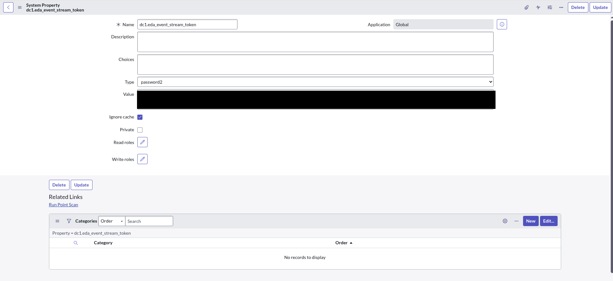

### 6.4 Outbound REST Message

**All → System Web Services → Outbound → REST Message → New:**

- **Name:** `REPLACE_ME_REST_MESSAGE` (e.g. `Ames - DC1.Azure EDA Event Stream`).
  ⚠️ ServiceNow caps `sys_rest_message.name` at **40 characters** — keep it short.
- **Endpoint:** the event-stream URL from §5.6.
- Add an **HTTP Method** named `POST`, with a single HTTP header:
  - `Content-Type: application/json`
- **No `Authorization` header here** — the Business Rule injects the bearer at runtime from
  the encrypted property, so the token never sits in plaintext in this record.
- **No body template needed** — the Business Rule builds the JSON and sets it with
  `setRequestBody()`.

> **Naming convention on a shared instance:** if many people share one ServiceNow instance,
> prefix REST Messages, Business Rules, and properties with your name (e.g.
> `Ames - …`, `Faith - …`, `Harris - …`) so they don't collide.

The REST Message with the **Endpoint** set (redacted here) and **Authentication type = No
authentication** — the bearer is injected by the Business Rule, not stored here:

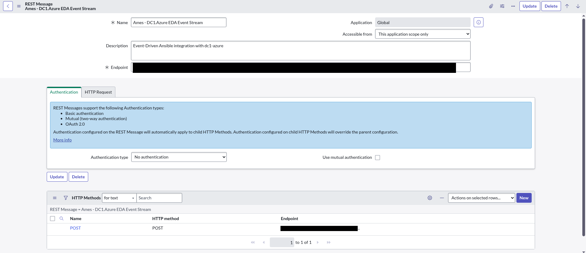

The **HTTP Request** tab shows the single **`Content-Type: application/json`** header — and
no `Authorization` header:

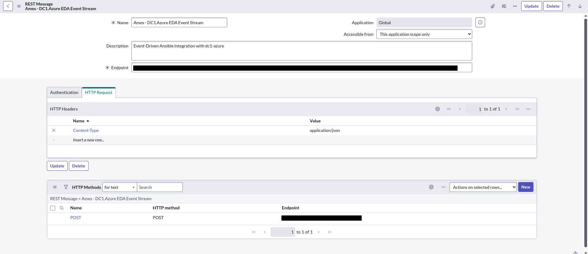

### 6.5 Business Rule — catalog pattern

**All → System Definition → Business Rules → New:**

- **Table:** Requested Item `[sc_req_item]`
- **Advanced:** ✅ **(required — the Script tab is ignored without it)**
- **When to run:** *before*, **Update = true** (fire once the RITM is approved). For the
  no-approval path (§6.2 Option B), use **Insert = true** instead.
- **Filter Conditions:** `Stage is Request Approved` **AND** `State is Work in Progress`,
  scoped to your requester(s), **AND** `Updated by is not <your AAP service account>` — the
  last clause stops AAP's own write-backs (RITM/CMDB updates) from re-firing the rule.

The *When to run* tab and the requester allowlist look like this:

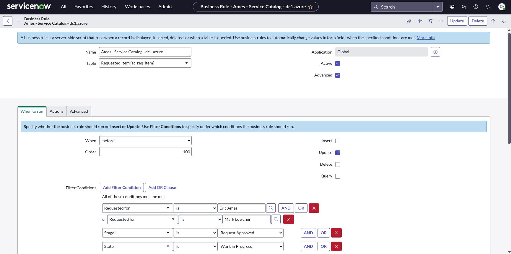

**Script** (Advanced → Script). Full worked example:
[`servicenow/business_rules/fire_eda_on_ritm.js`](https://github.com/ericcames/dc1.azure/blob/main/servicenow/business_rules/fire_eda_on_ritm.js).

```javascript
(function executeRule(current, previous) {
  var REST_MESSAGE_NAME = 'REPLACE_ME_REST_MESSAGE';   // the Outbound REST Message name (§6.4)
  var EVENT_NAME = 'SERVICE_CATALOG';

  try {
    function clean(v) { return (v == null) ? v : String(v).trim(); }   // trims trailing spaces

    var json = { event: EVENT_NAME };
    if (current.cat_item)          json.catalog_item     = clean(current.cat_item.getDisplayValue());
    if (current.number)            json.number           = clean(current.number.getDisplayValue());
    if (current.sys_id)            json.sys_id           = current.sys_id.toString();
    if (current.state)             json.state            = clean(current.state.getDisplayValue());
    if (current.short_description) json.short_description = clean(current.short_description.getValue('short_description'));
    if (current.stage)             json.stage            = clean(current.stage.getDisplayValue());

    if (current.opened_by) {
      var requester = current.opened_by.getRefRecord();
      if (requester.isValidRecord()) json.requester = requester.getValue('email');
    }

    // Auto-forward every catalog variable (os_type, vm_size_tier, future ones) with no edits.
    for (var key in current.variables) {
      if (current.variables.hasOwnProperty(key)) {
        json[key] = clean(current.variables[key].getDisplayValue());
      }
    }

    var r = new sn_ws.RESTMessageV2(REST_MESSAGE_NAME, 'POST');
    // Bearer token from the ENCRYPTED property — NOT a plaintext REST Message header.
    r.setRequestHeader('Authorization', 'Bearer ' + gs.getProperty('REPLACE_ME_PREFIX.eda_event_stream_token'));
    r.setRequestBody(JSON.stringify(json));
    r.setTimeout(10000);
    var resp = r.execute();
    gs.info('EDA trigger [' + json.number + '] -> HTTP ' + resp.getStatusCode());   // System Logs
  } catch (ex) {
    gs.error('EDA trigger failed: ' + ex.message);
  }
})(current, previous);
```

The same script viewed on the **Advanced → Script** tab (here named per the SE convention):

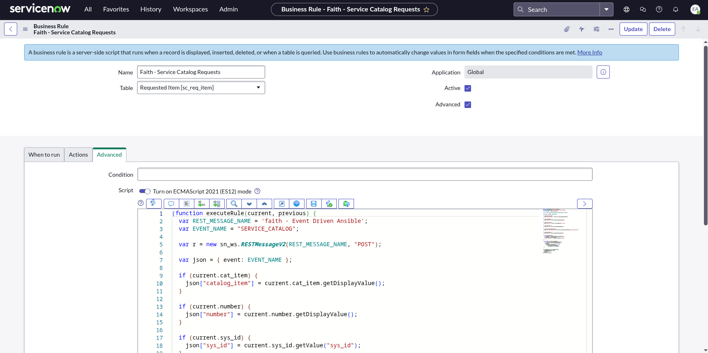

Note `clean()` (trims trailing whitespace so a Question Choice value like `"medium-2cpu-8gb "`
doesn't fail the workflow survey) and the `event` field that lets one event stream serve
multiple rulebooks.

### 6.6 Business Rule — incident pattern

To trigger AAP from an **incident** (e.g. a CVE ticket raised by Red Hat Insights), create a
second Business Rule scoped by **CI ownership** — it fires when an incident is opened against
a CI you manage.

- **Table:** Incident `[incident]`
- **Advanced:** ✅
- **When to run:** *after*, **Insert = true**
- **Filter Condition:** `cmdb_ci.managed_by = REPLACE_ME_USER_SYS_ID ^ state = 1` (a New
  incident on a CI you own)

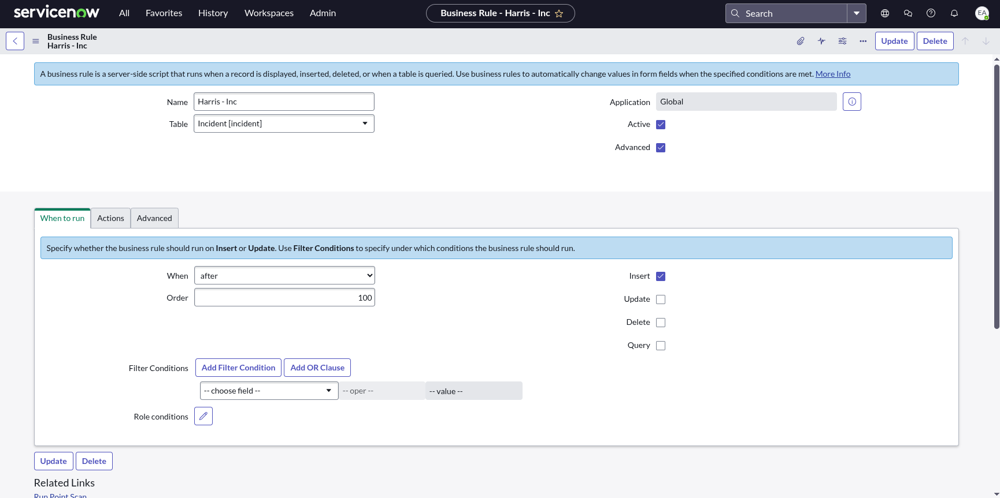

**Script** — same shape as the catalog rule, but reads incident fields and sets a different
`event` so the incident rulebook (§5.2) matches:

```javascript
(function executeRule(current, previous) {
  var REST_MESSAGE_NAME = 'REPLACE_ME_INCIDENT_REST_MESSAGE';
  var EVENT_NAME = 'CVE_INCIDENT';

  try {
    function clean(v) { return (v == null) ? v : String(v).trim(); }

    var json = { event: EVENT_NAME };
    if (current.number)            json.number            = clean(current.number.getDisplayValue());
    if (current.sys_id)            json.sys_id            = current.sys_id.toString();
    if (current.short_description) json.short_description = clean(current.short_description.getValue('short_description'));
    if (current.cmdb_ci) {
      json.cmdb_ci        = clean(current.cmdb_ci.getDisplayValue());
      json.cmdb_ci_sys_id = current.cmdb_ci.toString();
    }

    var r = new sn_ws.RESTMessageV2(REST_MESSAGE_NAME, 'POST');
    r.setRequestHeader('Authorization', 'Bearer ' + gs.getProperty('REPLACE_ME_PREFIX.eda_event_stream_token'));
    r.setRequestBody(JSON.stringify(json));
    r.setTimeout(10000);
    var resp = r.execute();
    gs.info('INC EDA trigger [' + json.number + '] -> HTTP ' + resp.getStatusCode());
  } catch (ex) {
    gs.error('INC EDA trigger failed: ' + ex.message);
  }
})(current, previous);
```

### 6.7 Adding a new person on a shared instance

- **Catalog allowlist:** open the catalog Business Rule → *When to run* → add an OR clause
  `Requested for is <new user>`.
- **New person's own pipeline:** each person creates their own REST Message
  (`<Name> - … EDA Event Stream`), their own token property (`<prefix>.eda_event_stream_token`),
  and points them at *their* AAP event stream — so events route to the right AAP.

### 6.8 ServiceNow service account (for AAP callbacks)

The **outbound** path (AAP → ServiceNow) authenticates as a dedicated **service account** —
the user whose host/name/password you put in `SN_HOST` / `SN_USERNAME` / `SN_PASSWORD` and
into the AAP credential from §5.7. Create it as an API-only user, not a person's login.

**Create the user** (*All → User Administration → Users → New*):

- **User ID:** e.g. `service.ansible` (this name appears on the tickets it touches — it's the
  `incident_caller` and CMDB CI `assigned_to`).
- **Active:** ✓
- **Identity type:** *Machine* — which enables **Web service access only = ✓** (the account
  can authenticate to the REST API but **cannot** log into the UI; best practice for an
  integration user).
- **Internal Integration User:** leave unchecked (an external integration account).
- Set a strong password (*Set Password*) and put it in `SN_PASSWORD`.

**Assign roles — least privilege for what the callbacks actually do:**

| Callback (playbook) | ServiceNow table | Needs to |
|---------------------|------------------|----------|
| Update RITM | `sc_req_item` | read + write (PATCH) |
| Create CMDB CI + link | `cmdb_ci_*`, `task_ci` | create/write |
| Create CMDB relationship | `cmdb_rel_ci` | create |
| Create incident | `incident` | create |

A workable least-privilege set: **`itil`** (RITM/incident/task write) + **`sn_request_write`**
+ **`sn_incident_write`** + a CMDB write role (**`sn_cmdb_editor`** or **`cmdb_inst_admin`**),
plus REST access (**`snc_platform_rest_api_access`**). Confirm against your instance's security
model and tighten as needed.

> **As-built note:** the worked-example demo account grants full **`admin`** for simplicity on
> a throwaway PDI. **Production should scope down** to the roles above — don't ship an `admin`
> integration user.

> **Branding tip (optional):** set the user's **Photo** to your automation logo (e.g. the
> Ansible mark). Every RITM work note, CMDB record, and incident the callbacks create then
> shows that avatar — a clear visual signal that *automation* did the work.

The service-account **user record** — *Identity type = Machine*, *Web service access only = ✓*,
*Active*, the Roles count, and the Ansible avatar (so its ticket activity is visibly
automation-driven). Email/phone are redacted here:

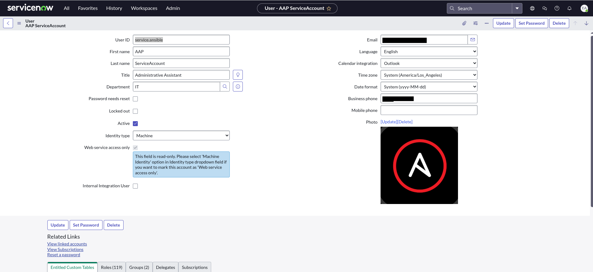

---

## 7. Verify end-to-end

1. **Pre-flight (no ServiceNow needed)** — POST a fake event straight at the event stream;
   the workflow should launch. If it does, any remaining problem is ServiceNow-side:

   ```bash
   curl -X POST 'REPLACE_ME_EVENT_STREAM_URL' \
     -H 'Authorization: Bearer REPLACE_ME_TOKEN' \
     -H 'Content-Type: application/json' \
     -d '{"short_description":"REPLACE_ME_SHORT_DESCRIPTION","vm_size_tier":"small-2cpu-4gb","number":"TEST","sys_id":"x"}'
   ```

2. **Place a real order** in the ServiceNow catalog and approve it.
3. **ServiceNow:** *System Logs → All* → look for `EDA trigger [RITM…] -> HTTP 200`.
   - `HTTP 200` = accepted. `HTTP 401` = token mismatch (re-check the matched pair / trailing
     newline). `Bearer ` with no token = the property is empty/misnamed.
4. **AAP:** the event stream's **events-received** count increments → the **rulebook
   activation** fires → the **workflow** launches (Automation Execution → Jobs).
5. **Round-trip:** when the workflow finishes, the RITM reaches *Closed Complete* with its
   **Stage = Request Approved**:

   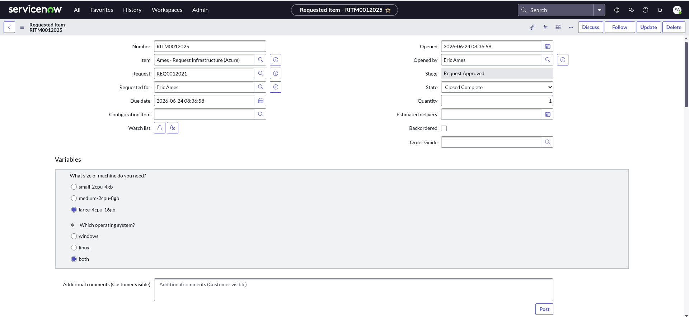

   AAP writes back **work notes** with the VM details (FQDN/IP redacted here) and an explicit
   note that the admin password stays in AAP — never on the ticket — plus the
   *State: Closed Complete was Work in Progress* field change:

   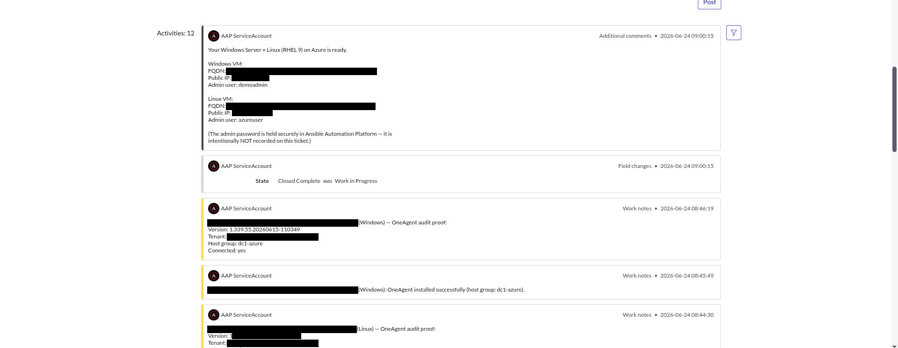

   The CMDB CI(s) are created and linked to the RITM under **Affected CIs**:

   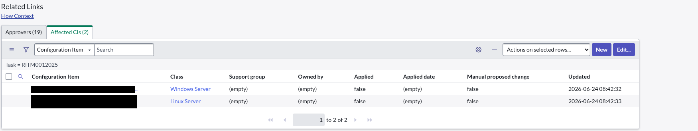

---

## 8. Gotchas (so you don't hit them)

- **Business Rule "Advanced" must be checked** or the Script tab is silently ignored.
- **Matched-pair token / trailing newline** — identical value on both sides; a stray newline
  on paste → `401`.
- **`short_description` is the trigger** — it must match the rulebook condition byte-for-byte.
- **`organization` in the rulebook** — the `run_workflow_template` action needs it (pass via
  the activation's `extra_vars`) or it errors and nothing launches.
- **Trim catalog values** — a trailing space on a Question Choice value fails the workflow
  survey's exact-match check (hence `clean()`).
- **40-char REST Message name limit** in `sys_rest_message`.
- **Shared instance** — namespace your objects and add each requester to the allowlist.
- **Flow vs. legacy Workflow** are mutually exclusive on a catalog item — use one.
- **EDA running-activation updates** — EDA rejects updates to a *running* activation; if CaC
  re-applies on every run, switch `extra_vars` to a block string (see §5.4).

---

## 9. Reference links

**This repo (worked example):**
- [`rulebooks/servicenow_events.yml`](https://github.com/ericcames/dc1.azure/blob/main/rulebooks/servicenow_events.yml) — catalog rulebook
- [`aap_config/files/eda_credentials.yml`](https://github.com/ericcames/dc1.azure/blob/main/aap_config/files/eda_credentials.yml),
  [`eda_projects.yml`](https://github.com/ericcames/dc1.azure/blob/main/aap_config/files/eda_projects.yml),
  [`eda_event_streams.yml`](https://github.com/ericcames/dc1.azure/blob/main/aap_config/files/eda_event_streams.yml),
  [`eda_rulebook_activations.yml`](https://github.com/ericcames/dc1.azure/blob/main/aap_config/files/eda_rulebook_activations.yml) — EDA CaC
- [`aap_config/files/controller_credential_types.yml`](https://github.com/ericcames/dc1.azure/blob/main/aap_config/files/controller_credential_types.yml),
  [`controller_credentials.yml`](https://github.com/ericcames/dc1.azure/blob/main/aap_config/files/controller_credentials.yml)
  — the custom `ServiceNow ITSM Credential` type + the `DC1.Azure - ServiceNow` instance (§5.7)
- [`servicenow/business_rules/fire_eda_on_ritm.js`](https://github.com/ericcames/dc1.azure/blob/main/servicenow/business_rules/fire_eda_on_ritm.js)
  — catalog Business Rule
- [`servicenow/README.md`](https://github.com/ericcames/dc1.azure/blob/main/servicenow/README.md) — ServiceNow-side install order
- [`docs/servicenow-integration.md`](https://github.com/ericcames/dc1.azure/blob/main/docs/servicenow-integration.md) — full design / as-built record
- [`playbooks/servicenow/`](https://github.com/ericcames/dc1.azure/tree/main/playbooks/servicenow) — the AAP→ServiceNow callback playbooks

**External:**
- [`infra.aap_configuration` (release/4.6.1)](https://github.com/redhat-cop/infra.aap_configuration/tree/release/4.6.1)
  — the EDA roles used in Part A
- [`servicenow.itsm` collection](https://github.com/ansible-collections/servicenow.itsm)
  — modules the callback playbooks use
- [`ansible.eda` collection](https://github.com/ansible/event-driven-ansible) —
  the `ansible.eda.webhook` source and rulebook-activation module
- [Red Hat: Event-Driven Ansible docs](https://docs.redhat.com/en/documentation/red_hat_ansible_automation_platform)
