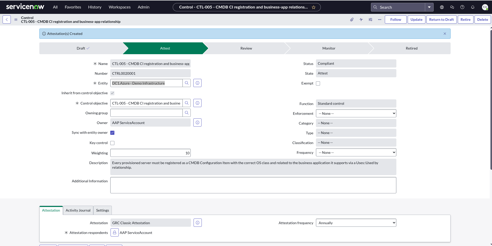
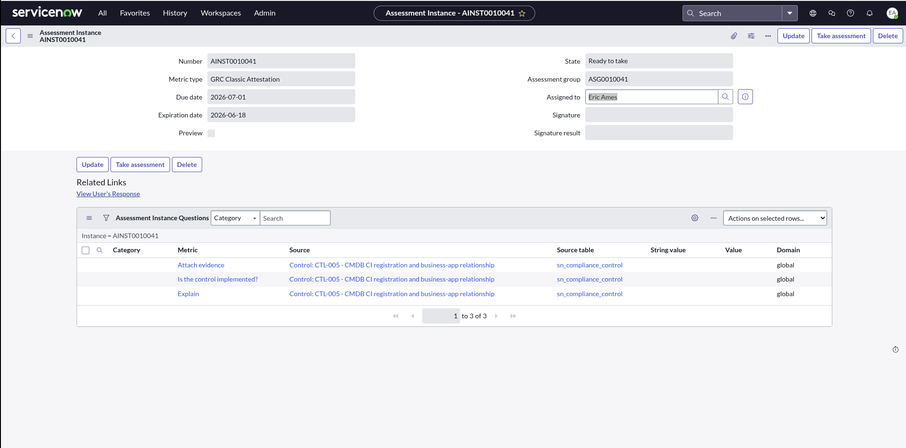
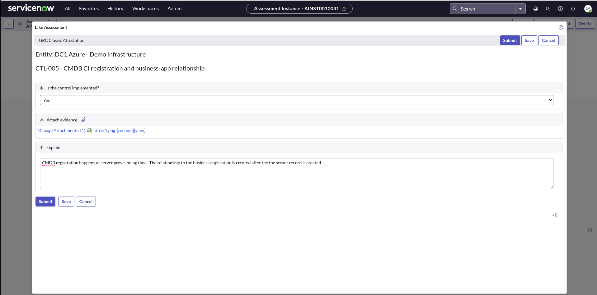
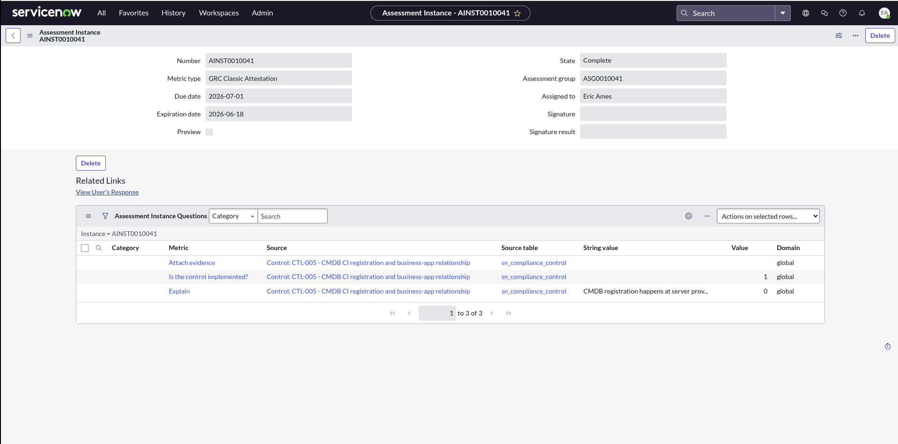
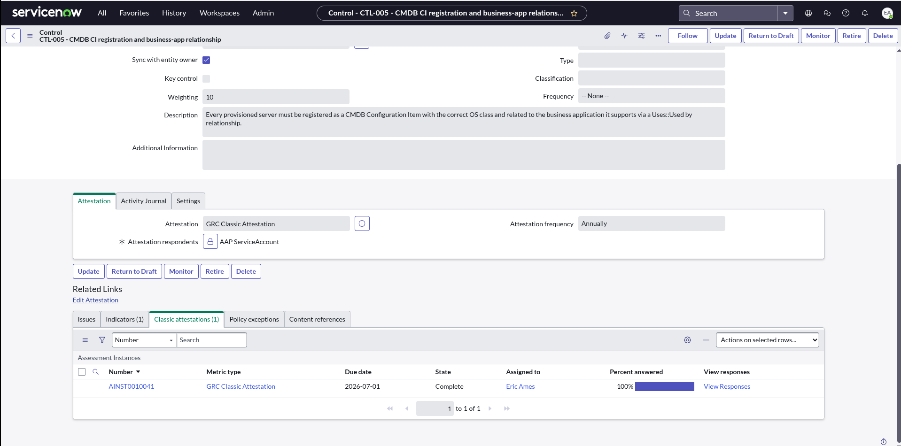
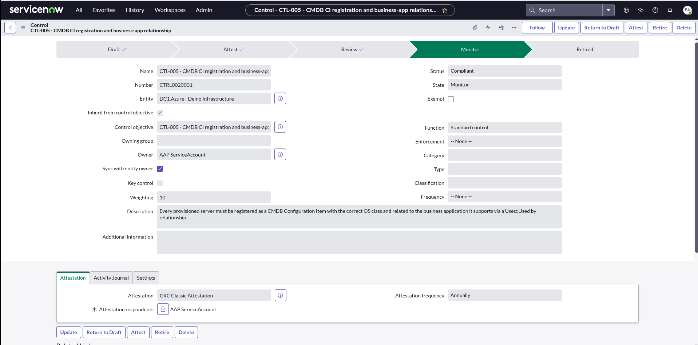

# The GRC auditor walkthrough — attesting a control (CTL-005)

How an auditor (or control owner) takes a **classic attestation** against the
dc1.azure controls in ServiceNow Policy & Compliance Management, and how the
control moves through its **Draft → Attest → Review → Monitor** lifecycle. This
is the human-facing companion to the
[controls build guide](servicenow-grc-controls-build.md) — that doc builds the
control + automated indicator; this one walks the attestation a person performs
on top of it.

> **Captured on:** Now Platform **Yokohama**, **GRC: Policy and Compliance
> Management `sn_compliance` 22.0.2**. GRC table names/behaviour can shift across
> releases — re-verify on yours.
>
> **Prerequisite:** the control exists and its indicator has rolled up
> ([`servicenow-grc-controls-build.md`](servicenow-grc-controls-build.md)). This
> walkthrough uses **CTL-005** → control **CTRL0020001** (*CMDB CI registration
> and business-app relationship*), profile *DC1.Azure - Demo Infrastructure*.

---

## The control lifecycle

A Policy & Compliance control is a small state machine. The automated indicator
keeps it *Compliant* continuously; the attestation is the periodic human
sign-off that the control is genuinely implemented:

```
Draft ──(Attest)──▶ Attest ──(attestation complete)──▶ Review ──▶ Monitor
                       │
                       └─ creates a GRC Classic Attestation (asmt_assessment_instance)
                          assigned to a respondent, with the metric-type's questions
```

| Stage | Meaning |
|-------|---------|
| **Draft** | control authored, not yet in force |
| **Attest** | a respondent has been asked to attest; an attestation instance is live |
| **Review** | attestation submitted; awaiting reviewer acceptance |
| **Monitor** | accepted — control is live and watched by its indicator |

---

## The GRC attestation data model

The attestation is a regular ServiceNow **Assessment**, surfaced through GRC:

| Record | Table | Role |
|--------|-------|------|
| Metric Type | `asmt_metric_type` | the survey definition — *GRC Classic Attestation* (its questions, duration, schedule) |
| Assessment Instance | `asmt_assessment_instance` | the actual attestation assignment (e.g. **AINST0010041**) — has a `state`, a `user` (respondent), a `due_date` |
| Instance Questions | `asmt_assessment_instance_question` | the per-instance questions mapped from the metric type (here: *Is the control implemented?*, *Explain*, *Attach evidence*) |

Roles that can take an attestation: `sn_compliance.user` +
`sn_compliance.control_framework_user` (an **`admin`** inherits both).

---

## Step 1 — advance the control to Attest

Open the control (**CTRL0020001**) and click **Attest**. The platform creates a
**GRC Classic Attestation** instance, assigns it to the control's attestation
respondent, and moves the control to **Attest**.



The attestation (**AINST0010041**) is now *Ready to take* — metric type *GRC
Classic Attestation*, with three questions sourced from the control, and a due
date.



---

## Step 2 — the respondent gotcha (service account can't be impersonated)

By default the attestation may be assigned to whatever user owns the control —
in this build that was the **AAP ServiceAccount** (`service.ansible`). You
**cannot** take the attestation by impersonating that account:

> **Gotcha:** the integration account has **`web_service_access_only = true`**.
> That flag lets it authenticate only via REST/SOAP — never an interactive UI
> session — so ServiceNow deliberately **omits it from the Impersonate User
> picker** (searching either the login `service.ansible` or the display name
> *AAP ServiceAccount* returns "No results found"). It also holds `admin`, which
> can't be impersonated anyway. This is **not** a missing-permission problem —
> no role grant fixes it.

The clean fix — and the more realistic auditor story — is to **reassign the
attestation respondent to a human user** and take it as yourself. A human
control owner attesting is the genuine GRC pattern. Repoint the instance's
`user` field (scoped by `sys_id`):

```bash
source docs/dev-environment.sh && \
curl -s -u "$SN_USERNAME:$SN_PASSWORD" -X PATCH \
  -H "Content-Type: application/json" \
  -d '{"user":"<human-user-sys_id>"}' \
  "$SN_HOST/api/now/table/asmt_assessment_instance/<instance-sys_id>"
```

(or in the UI: open the attestation → set **Assigned to** → **Update**). The
state stays *Ready to take*; it now appears in the human respondent's queue.

> Alternative if you must keep the service account as attester: uncheck
> **Web service access only** on its user record first — but that widens the
> integration account's footprint (it can then log in interactively), so prefer
> reassignment.

---

## Step 3 — take the attestation

As the (now human) respondent, open the take-assessment UI directly:

```
https://<instance>.service-now.com/assessment_take2.do?sysparm_assessment_id=<instance-sys_id>
```

(or **Self-Service → My Assessments & Surveys** → the instance). Answer the
three questions and **Submit**:

- **Is the control implemented?** → *Yes*
- **Attach evidence** → attach a screenshot / artifact (here: the live CMDB CI)
- **Explain** → a short rationale



On submit the instance flips to **Complete** (100%), records the answers, and
stamps `taken_on` / the respondent.



**The evidence behind the answer** — what makes the attestation more than a
checkbox is that it points at live data. CTL-005 attests that provisioned
servers are registered as CMDB CIs *and* linked to their business application;
the CI shows exactly that relationship, created by `service.ansible` at
provisioning time:

![Linux Server CI in CMDB with a Uses → [L1] Ansible Demonstrations business-app relationship, created by service.ansible](images/grc-audit-05-cmdb-evidence.png)

---

## Step 4 — Review → Monitor

Completing the attestation **auto-advances** the control to **Review** — no
manual step (verified live: `CTRL0020001.state = Review` immediately after
submit).



Advance **Review → Monitor** to finish the lifecycle (the control form's
**Monitor** action / state field). The control is now live and continuously
watched by its indicator (IND0020006).



---

## Verify (read-only API)

Confirm the attestation completed and who took it:

```bash
source docs/dev-environment.sh && \
curl -s -u "$SN_USERNAME:$SN_PASSWORD" \
  "$SN_HOST/api/now/table/asmt_assessment_instance?sysparm_query=number=AINST0010041&sysparm_fields=number,state,taken_on,user&sysparm_display_value=true"
```

Expected: `state = Complete`, a `taken_on` timestamp, `user` = the human
respondent.

> **ACL note:** reading `sn_compliance_control` fields such as
> `attestation_status` under the `service.ansible` account returns
> *"Insufficient rights to query records"* — that account's GRC read scope is
> narrow. Read control-state fields as an `admin` user instead.

---

## Records used (this walkthrough)

| Record | Identifier |
|--------|-----------|
| Control | `CTRL0020001` — *CTL-005 - CMDB CI registration and business-app relationship* |
| Metric Type | *GRC Classic Attestation* (`asmt_metric_type`) |
| Attestation Instance | `AINST0010041` (`asmt_assessment_instance`) |

## Related

- [`servicenow-grc-controls-build.md`](servicenow-grc-controls-build.md) — build the control + automated indicator (Path A)
- [`controls-attestation-servicenow.md`](controls-attestation-servicenow.md) — the design / why
- [`servicenow-grc-setup.md`](servicenow-grc-setup.md) — installing the GRC module
- [`controls.md`](controls.md) — the underlying control statements
