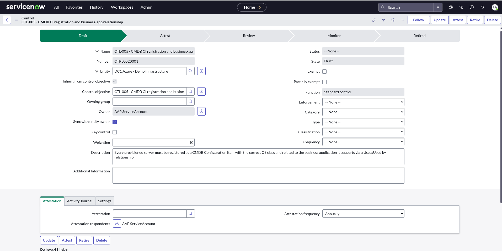
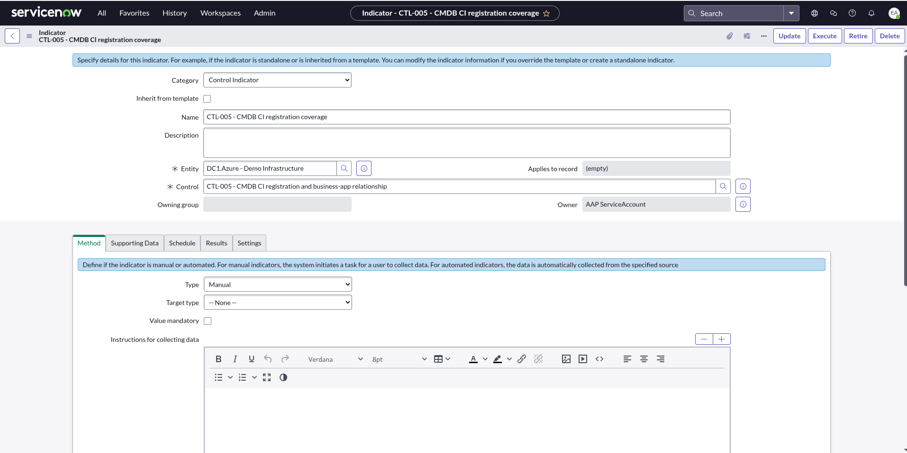

# Building the GRC controls + indicators (reproduction guide)

How the dc1.azure IT controls (`controls.md`) are built into ServiceNow Policy &
Compliance Management as **Controls** with **continuous-monitoring Indicators** —
"Path A" of the [attestation design](controls-attestation-servicenow.md). Written
so a customer or another SE can recreate it on their own instance.

> **Captured on:** Now Platform **Yokohama**, **GRC: Policy and Compliance
> Management `sn_compliance` 22.0.2**. GRC table names/behaviour can shift across
> releases — re-verify on yours.
>
> **Prerequisite:** GRC must be installed ([`servicenow-grc-setup.md`](servicenow-grc-setup.md)).
> Verify: `GET /api/now/table/sn_compliance_control` → `HTTP 200`.
>
> **Scope:** ships the **CTL-005** (CMDB registration) working slice. The pattern
> replicates to the other ServiceNow-native controls (CTL-001, CTL-004); CTL-002
> and CTL-003 need AAP to push evidence into ServiceNow first (see the design doc).

---

## The GRC data model (what we learned)

Policy & Compliance records form this chain. Tables and their parents:

| Record | Table | Extends | Role |
|--------|-------|---------|------|
| Profile | `sn_grc_profile` | — | the entity being assessed (our infra scope) |
| Control Objective | `sn_compliance_policy_statement` | `sn_grc_content` | the "what must be true" statement |
| Control | `sn_compliance_control` | `sn_grc_item` | objective **applied to** a profile |
| Indicator | `sn_grc_indicator` | `sn_grc_base_indicator` | automated test that produces results |
| Indicator Result | `sn_grc_indicator_result` | — | a Pass/Fail data point (system-created) |
| Control Issue | `sn_grc_issue` | — | auto-raised when an indicator fails |

Key relationships: a **Control** links `content` → the Objective and `profile` →
the Profile. An **Indicator** links `item` → the Control; its `entity` (Profile)
is **derived** from the control. Automated-collection fields (`table`, `criteria`,
`target`) are inherited by the indicator from `sn_grc_base_indicator`.

---

## The fast path — run the playbook

The whole structure is codified and idempotent:

```bash
source docs/dev-environment.sh && \
ansible-playbook playbooks/servicenow/create_grc_controls.yml \
  2>&1 | tee /tmp/grc-controls-$(date +%Y%m%d-%H%M%S).log
```

It creates (or reuses) the Profile, and for each control in `grc_controls`: the
Control Objective, the Control, and the Indicator (with its `criteria`/`target`
config). Re-running is safe — existing records are matched by name and skipped.

Then complete the **one manual step** below (the indicator's `table`).

---

## What the playbook does, step by step (and the gotchas)

If you'd rather build it by hand (or understand the playbook), this is the exact
recipe, including three non-obvious gotchas discovered live.

1. **Profile** — `POST sn_grc_profile` with `name`, `profile_class` (the seeded
   **Server** class), `owned_by` (a user sys_id). Profile classes ship seeded
   (Server, Application, Computer, …) so no class creation is needed.

2. **Control Objective** — `POST sn_compliance_policy_statement` with `name`,
   `description`, `reference` (e.g. `CTL-005`). *It does **not** need a parent
   Policy* — which is convenient, because a Policy (`sn_compliance_policy`) has
   heavyweight mandatory prerequisites (a knowledge base + article template).

3. **Control** — `POST sn_compliance_control` with `content` = the objective
   sys_id, `profile` = the profile sys_id, and the mandatory
   `implementation_statement`. The platform copies the objective's name and
   auto-numbers it (e.g. `CTRL0020001`, state `Draft`).

   

4. **Indicator** — `POST sn_grc_indicator` with `name` + `item` = the control
   sys_id **only**.
   > **Gotcha 1:** do **not** send `entity` or `template` on the indicator —
   > either trips the *"Verify entity change"* business rule and aborts the
   > insert. The entity (Profile) is derived from the control automatically.

   

   *(Captured while still "Manual"; the playbook then sets it to **Basic** — see
   step 5.)*

5. **Configure the indicator (automated)** — `PATCH sn_grc_indicator/{sys_id}`
   with `type: basic`, `criteria` (an encoded query over a ServiceNow table),
   `sample_collection_type` (count/percentage), `target_type`, `target`,
   `collection_frequency`, `active: true`.
   For CTL-005 the criteria counts live DC1.Azure server CIs:
   `short_descriptionLIKECreated by the DC1.Azure demo^install_status!=7`.

   > **Gotcha 2:** the indicator's data-source **`table` field is UI-only.** The
   > REST Table API silently drops writes to `sn_grc_base_indicator.table` (tried
   > on insert, PATCH, and display-value — all no-ops; the field is not read-only
   > and no business rule touches it, yet it won't persist via API). So `table`
   > is the **one manual step** — see below.

---

## The one manual step — set the indicator's Table, then Execute

In the GRC UI:

1. Open the indicator (**IND0020006** — *CTL-005 - CMDB CI registration coverage*).
2. **Method** tab → set **Table** = `Server [cmdb_ci_server]`. (The **Type** is
   already *Basic* and the **Condition** is already populated by the playbook.)
3. **Save**, then click **Execute** to run collection immediately (otherwise it
   runs on the daily schedule).

This produces an **Indicator Result** and rolls the Pass/Fail up to the Control.

> **Gotcha 3:** you cannot push results from outside. Both
> `sn_grc_indicator_result` and `sn_grc_indicator_task` have **create ACLs locked
> to role `nobody` with `admin_overrides=false`** — ServiceNow's "system-only"
> pattern. So results must be produced by the engine (native automated
> collection, as here) or by completing a system-generated Indicator Task (which
> needs the `sn_grc.business_user` role). A naive "AAP POSTs a result" is rejected
> regardless of roles — which is exactly why the native automated indicator is
> the clean model for ServiceNow-resident evidence.

---

## Verify

- **Indicator → Results tab** shows a Pass/Fail row with the collected count.
- **Control CTRL0020001** reflects the indicator's status; a failing indicator
  raises a **Control Issue** (`sn_grc_issue`).
- Read-only API check of the indicator's last result:
  ```bash
  curl -s -u "$SN_USERNAME:$SN_PASSWORD" \
    "$SN_HOST/api/now/table/sn_grc_indicator?sysparm_query=numberSTARTSWITHIND&sysparm_fields=number,name,last_result_passed,type"
  ```

---

## Extending to the other controls

Append to `grc_controls` in `create_grc_controls.yml`:

- **CTL-001** (OneAgent everywhere) and **CTL-004** (RITM↔AAP traceability) are
  ServiceNow-native — give them a `criteria` over the relevant table (RITM work
  notes / a CI attribute) and they work the same way.
- **CTL-002** (nightly teardown) and **CTL-003** (no stale tokens) have their
  evidence in **AAP, not ServiceNow**. For those, AAP must first push a signal
  into a readable ServiceNow table (e.g. a CI attribute or a small custom table),
  which a basic indicator then reads. Tracked as the AAP-push follow-up in the
  [design doc](controls-attestation-servicenow.md#6-two-paths-forward).

> **Related — CMDB record creation.** CMDB CIs are the evidence these indicators
> read. dc1.azure creates them via `playbooks/servicenow/create_ci.yml`; a sibling
> project, [`toharris-rh/aap.lightspeed.patching`](https://github.com/toharris-rh/aap.lightspeed.patching),
> also creates CMDB records — a useful cross-reference for CI shapes/patterns when
> tuning indicator `criteria`.

---

## Records created (this slice)

| Record | Identifier |
|--------|-----------|
| Profile | `DC1.Azure - Demo Infrastructure` |
| Control Objective | `CTL-005 - CMDB CI registration and business-app relationship` |
| Control | `CTRL0020001` |
| Indicator | `IND0020006` — *CTL-005 - CMDB CI registration coverage* |

## Related

- [`controls-attestation-servicenow.md`](controls-attestation-servicenow.md) — the design / why
- [`servicenow-grc-setup.md`](servicenow-grc-setup.md) — installing the GRC module
- [`controls.md`](controls.md) — the underlying control statements
- `playbooks/servicenow/create_grc_controls.yml` + `grc_control_tasks.yml` — the build
