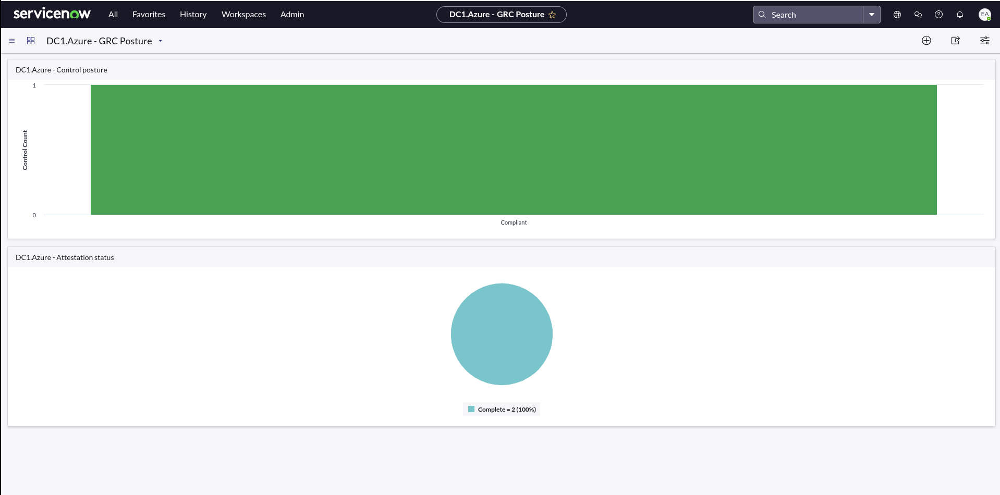
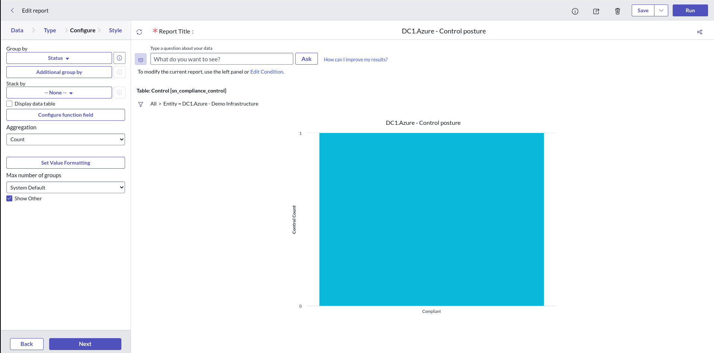
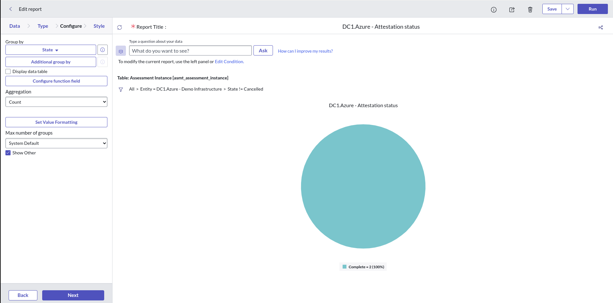

# GRC posture dashboard — controls & attestations at a glance

A single **demo / customer-facing** view that answers *"where are we with our
controls and attestations?"* in ServiceNow. Built **OOB-first** — two
profile-scoped reports assembled onto a responsive dashboard — which is the
*"Compliance dashboard / auditor view"* the design doc
([`controls-attestation-servicenow.md`](controls-attestation-servicenow.md) §4)
ends at.

> **New here?** Start at the [GRC documentation index](servicenow-grc-README.md).

> **Captured on:** Now Platform **Yokohama**, **GRC: Policy and Compliance
> Management `sn_compliance` 22.0.2**. Table/UI names shift across releases —
> re-verify on yours.
>
> **Prerequisite:** the control + indicator are built
> ([`servicenow-grc-controls-build.md`](servicenow-grc-controls-build.md)) and at
> least one attestation taken
> ([`servicenow-grc-auditor-walkthrough.md`](servicenow-grc-auditor-walkthrough.md)).



---

## The one idea that makes it scale: filter by **profile**

Both reports filter on the GRC **profile** (`DC1.Azure - Demo Infrastructure`),
**not** on the individual control:

| Report source table | Profile field |
|---------------------|---------------|
| `sn_compliance_control` | **Profile** (`profile`) |
| `asmt_assessment_instance` | **GRC Profile** (`sn_grc_profile`) |

Because attestation instances carry the same `sn_grc_profile`, one filter covers
both controls and their attestations — and **any new control added to that
profile (and its attestations) appears automatically**, with zero dashboard
rework. On a **shared instance** this scoping is mandatory: it keeps the view to
*your* data instead of every other team's controls.

---

## Build the two reports (UI, ~2 min each)

**Reports → Create a report** for each.

### Report 1 — `DC1.Azure - Control posture`
- **Source type:** Table → **Control [`sn_compliance_control`]**
- **Condition:** `Profile` **is** `DC1.Azure - Demo Infrastructure`
- **Type:** Bar · **Group by → Status** · Aggregation **Count**
- Save as `DC1.Azure - Control posture`.



### Report 2 — `DC1.Azure - Attestation status`
- **Source type:** Table → **Assessment instance [`asmt_assessment_instance`]**
- **Condition:** `GRC Profile` **is** `DC1.Azure - Demo Infrastructure`
  **AND** `State` **is not** `Cancelled`
- **Type:** Pie · **Group by → State** · Aggregation **Count**
- Save as `DC1.Azure - Attestation status`.



> **Why exclude `State = Cancelled`:** re-attesting a control (Return to Draft →
> Attest) leaves *Cancelled* instances behind (see the auditor-walkthrough doc).
> Excluding them keeps the pie a clean "what's actually been attested" view.

---

## Assemble the dashboard

1. **All → Dashboards → Create a dashboard** → name **`DC1.Azure - GRC Posture`**.
2. **Add widgets** (the `+` / widget picker) → **Widget Category: Reports**.
3. Search and add **`DC1.Azure - Control posture`** and
   **`DC1.Azure - Attestation status`**.
4. *(optional, for the "OOB already covers this" beat)* add shipped reports like
   **All Attestations** or **Overall Compliance**.
5. Arrange both charts on one screen → **Save**.

---

## Gotchas (learned live — read before you script this)

- **The widget picker hides API/script-created reports.** If you create reports
  via the Table API (or any script), they're owned by the integration user, and
  the dashboard **Add Widgets** picker defaults to **"Created by me"** → shows
  *"No data available for Reports."* **Fix:** flip the picker filter
  **Created by me → All**, *or* reassign the report's **owner** (`sys_report.user`)
  to the human building the dashboard.
- **Don't attach widgets to a responsive dashboard via the Table API.** Platform
  Analytics dashboards place widgets through a tab → canvas → widget chain that
  isn't exposed as clean Table-API fields (a naive `pa_tabs?dashboard=<id>` query
  returns *every* tab on the instance). Build the **layout in the UI**; only the
  underlying **reports** are worth scripting.
- **Scope by profile, never instance-wide.** OOB GRC reports (*All Attestations*,
  *Overall Compliance*, …) are instance-wide — fine as drill-downs, wrong as the
  headline on a shared instance. Always filter custom reports to the DC1.Azure
  profile and namespace them `DC1.Azure -`.

---

## (Optional) Create the reports as code

The two `sys_report` records *are* API-friendly (only dashboards are not), so they
can be scripted for reproducibility — e.g.:

```bash
source docs/dev-environment.sh
PROFILE=<dc1-azure-profile-sys_id>   # sn_grc_profile "DC1.Azure - Demo Infrastructure"
curl -s -u "$SN_USERNAME:$SN_PASSWORD" -X POST -H "Content-Type: application/json" \
  -d "{\"title\":\"DC1.Azure - Attestation status\",\"table\":\"asmt_assessment_instance\",\
\"filter\":\"sn_grc_profile=$PROFILE^state!=canceled\",\"type\":\"pie\",\
\"field\":\"state\",\"aggregate\":\"COUNT\",\"is_published\":\"true\",\"user\":\"<human-sys_id>\"}" \
  "$SN_HOST/api/now/table/sys_report"
```

Set `user` to a human at creation to avoid the "Created by me" picker gotcha.
This could be codified into a thin idempotent `create_grc_reports.yml` later —
**not built yet** (the reports here were created live via the Table API).

---

## Get to the dashboard

- **UI:** **All → Dashboards → `DC1.Azure - GRC Posture`** (or search "GRC Posture").
- **Direct link:**
  `https://<instance>.service-now.com/$pa_dashboard.do?sysparm_dashboard=<dashboard_sys_id>`
  — find `<dashboard_sys_id>` in **`pa_dashboards`** (filter name = the dashboard),
  or use the dashboard's **Share** icon → *Copy link* for the canonical URL.
- **Individual report:**
  `https://<instance>.service-now.com/sys_report_template.do?jvar_report_id=<report_sys_id>`
  — `<report_sys_id>` from **`sys_report`** (`title STARTSWITH 'DC1.Azure -'`).

---

## Records (this build)

| Artifact | Identifier |
|----------|-----------|
| Dashboard | `DC1.Azure - GRC Posture` (`pa_dashboards`) |
| Report | `DC1.Azure - Control posture` (`sys_report`, `sn_compliance_control`) |
| Report | `DC1.Azure - Attestation status` (`sys_report`, `asmt_assessment_instance`) |
| Scope filter | profile `DC1.Azure - Demo Infrastructure` (`sn_grc_profile`) |

## Related

- [`servicenow-grc-auditor-walkthrough.md`](servicenow-grc-auditor-walkthrough.md) — taking the attestation
- [`servicenow-grc-controls-build.md`](servicenow-grc-controls-build.md) — building the control + indicator
- [`controls-attestation-servicenow.md`](controls-attestation-servicenow.md) — the design / why
- [`servicenow-grc-setup.md`](servicenow-grc-setup.md) — installing the GRC module
