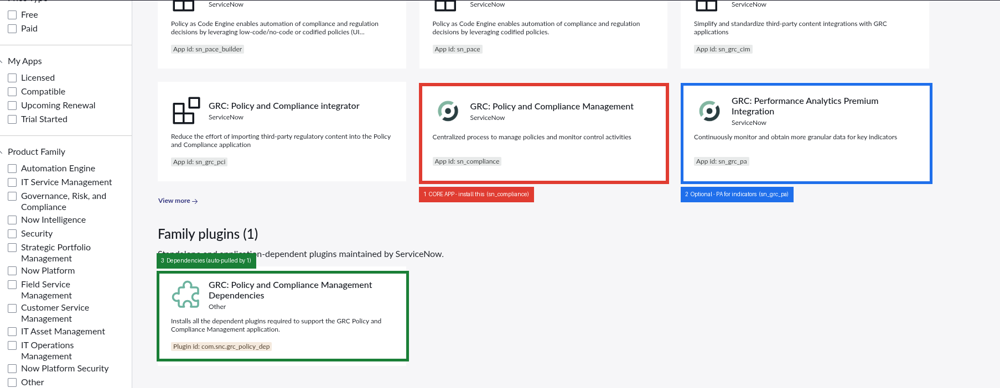
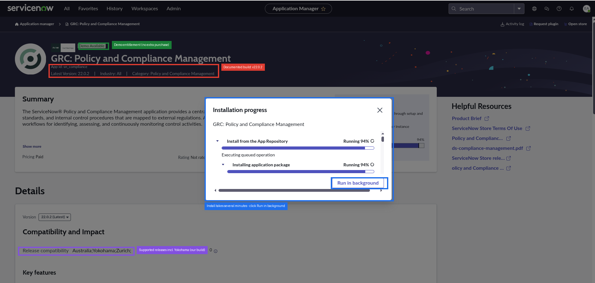
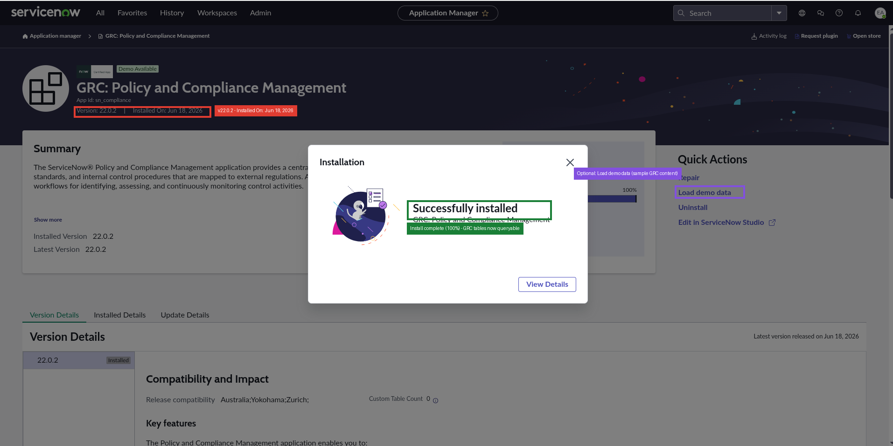

# Setting up ServiceNow Policy & Compliance Management (customer guide)

A step-by-step walkthrough for installing the ServiceNow **Policy and Compliance
Management** (IRM/GRC) application that the dc1.azure
[continuous-attestation design](controls-attestation-servicenow.md) depends on.
This is the **Path A** ("real GRC") prerequisite: it creates the Control,
Control Test, Indicator, and Control Issue tables the attestation model writes to.

> **Who this is for:** a customer (or demo engineer) standing up GRC on their own
> ServiceNow instance. You need the **admin** role and the application must be
> entitled to your instance (see [Entitlement](#entitlement)).

---

## Environment this was captured on

| Item | Value |
|------|-------|
| Now Platform release | **Yokohama** (Patch 12 Hotfix 1b, build `glide-yokohama-12-18-2024__patch12-hotfix1b`, 2026-05-05) |
| Application | **GRC: Policy and Compliance Management** — app id `sn_compliance` |
| Application version | **22.0.2** (Latest) |
| Dependency plugin | **GRC: Policy and Compliance Management Dependencies** — `com.snc.grc_policy_dep` |
| Optional companion | **GRC: Performance Analytics Premium Integration** — `sn_grc_pa` |
| Entitlement on this instance | **Demo Available** (installed without a separate purchase) |

> **Version note:** these steps and table names reflect Yokohama / `sn_compliance`
> 22.0.2. ServiceNow renames GRC tables across releases — confirm against your own
> instance. The store UI also changes between releases; the *concepts* (find app →
> install → dependencies → verify) are stable.

---

## Entitlement

Policy and Compliance Management is a **Paid** product within Integrated Risk
Management (IRM). Whether you can install it depends on your instance:

- **"Install" button shown** → entitled (e.g. a *Demo Available* badge, as here, or
  a purchased IRM subscription). Proceed.
- **"Request" button shown** → not entitled; the request routes to ServiceNow to
  enable the SKU. Engage your ServiceNow account team.
- **Fastest demo path:** if your sales/demo program offers an instance that already
  ships IRM, use that rather than retrofitting a bare instance.

---

## Step 0 — Check whether it's already installed (read-only)

From any host with the instance credentials, probe the core control table:

```bash
curl -s -o /dev/null -w "HTTP %{http_code}\n" -u "$SN_USERNAME:$SN_PASSWORD" \
  "$SN_HOST/api/now/table/sn_compliance_control?sysparm_limit=1"
```

- **HTTP 400** ("Invalid table") → GRC is **not** installed. Continue below.
- **HTTP 200** → GRC is already installed; skip to
  [building the controls](controls-attestation-servicenow.md#7-build-it-later-future-implementation-phase).

---

## Step 1 — Find the application in the Store

As admin, open **All > System Applications > All Available Applications > All**
(the Application Manager), and search for **"Policy and Compliance"**.



What to install:

1. **`1` GRC: Policy and Compliance Management** (`sn_compliance`) — **the core
   app. This is the one you need.** It creates the Control / Control Test /
   Indicator / Control Issue tables.
2. **`2` GRC: Performance Analytics Premium Integration** (`sn_grc_pa`) —
   *optional but recommended.* Powers the **continuous-monitoring indicators and
   dashboards** the attestation design leans on. Install after the core app.
3. **`3` GRC: Policy and Compliance Management Dependencies**
   (`com.snc.grc_policy_dep`) — the foundation plugins (GRC base `com.sn_grc`,
   assessments, etc.). **Normally pulled in automatically** when you install the
   core app — you rarely install this card by hand.

> The other GRC cards (`sn_grc_pci` regulatory-content importer, `sn_grc_cim`
> third-party integrations, `sn_pace`/`sn_pace_builder` Policy-as-Code) are **not
> required** for the internal CTL-001…005 attestation model. Skip them for now.

---

## Step 2 — Install the core app

Open the **GRC: Policy and Compliance Management** card and click **Install**
(pick the latest version). The installer runs the App Repository download plus the
dependency plugins.



- The header confirms what you're installing: **app id `sn_compliance`**,
  **Latest Version 22.0.2**, and the **Demo Available** entitlement. The
  **Release compatibility** row lists **Australia; Yokohama; Zurich** — our
  instance is on Yokohama.
- Installs take **several minutes** (it's pulling the dependency plugins too).
  Click **Run in background** and keep working — ServiceNow finishes it
  server-side. Watch the **Activity log** (top right) for completion.
- The GRC tables are created in the **final stages** of the install — in practice
  the Step 0 probe flipped from 400 to **200 at ~94%**, before the UI reported
  100%. Still wait for the Activity log to show success before using the app.

---

## Step 3 — Verify the install

When it finishes you get a **"Successfully installed"** confirmation, and the app
page header shows **Installed Version 22.0.2** with an **Installed On** date.



Re-run the Step 0 probe — it should now flip to **HTTP 200**:

```bash
curl -s -o /dev/null -w "HTTP %{http_code}\n" -u "$SN_USERNAME:$SN_PASSWORD" \
  "$SN_HOST/api/now/table/sn_compliance_control?sysparm_limit=1"
```

In the UI, you should now see a **Policy and Compliance** application menu, and the
guided setup ("through setup and …" panel on the app page) becomes available.

> **Tip — Load demo data.** The app page's **Quick Actions** include **Load demo
> data**, which seeds sample Authority Documents, Policies, and Controls. Handy for
> exploring the module before you build the dc1.azure controls — but load it into a
> non-production / demo instance only, and don't confuse the sample controls with
> the CTL-001…005 records you'll create for this integration.

**Verified on this instance (2026-06-17, Yokohama / `sn_compliance` 22.0.2)** — all
core GRC tables came back `HTTP 200` after install:

| Table | Purpose | Result |
|-------|---------|--------|
| `sn_compliance_control` | Control records (one per CTL-xxx) | 200 |
| `sn_compliance_policy` | Policies | 200 |
| `sn_grc_indicator` | Continuous-monitoring indicators | 200 |
| `sn_grc_issue` | Control Issues (auto-raised on breach) | 200 |
| `sn_grc_profile` | GRC profiles | 200 |

(These are Store-delivered scoped apps, so they do **not** appear in the classic
`sys_plugins` table — that's expected.)

---

## Next — build the controls

With GRC live, follow **Path A** in the
[continuous-attestation design](controls-attestation-servicenow.md#6-two-paths-forward):

1. Create 5 **Control** records (CTL-001…005) from [`controls.md`](controls.md).
2. Define the **continuous-monitoring Indicators** against the evidence dc1.azure
   already produces (CMDB CIs, `task_ci`, immutable `snow_log` work notes, AAP job
   history).
3. Wire **Control Issue** auto-creation on threshold breach.

---

## Related

- [`controls-attestation-servicenow.md`](controls-attestation-servicenow.md) — the design / mapping (why we're doing this)
- [`controls.md`](controls.md) — the 5 control statements + evidence locations
- [`servicenow-integration.md`](servicenow-integration.md) — the AAP ↔ ServiceNow integration this builds on
